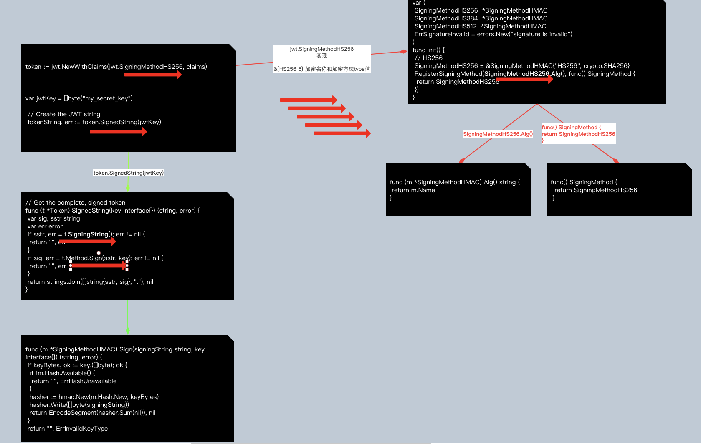

# JWT

一个JWT由三部分组成，头部、载荷与签名。

## 1、头部

用于说明签名的加密算法等，下面类型的json经过base64编码后得到JWT头部

```go
{
  "typ": "JWT",
  "alg": "HS256"
}
```

> type : 加密的名称
>
> alg : 加密的方式，默认sha256

## 2、有效负载

包含生成Token时间，过期时间，以及一些身份标识,标准定义了6个字段，载荷json经过base64编码后得到JWT的载荷：

```go
sub: 该JWT所面向的用户
iss: 该JWT的签发者
iat(issued at): 在什么时候签发的token
exp(expires): token什么时候过期
nbf(not before)：token在此时间之前不能被接收处理
jti：JWT ID为web token提供唯一标识
```

> 一版是存储用户名和过期时间等等信息，用于后续验证

```go
{
    "sub": "1",
    "iss": "httpHandler://localhost:8000/user/sign_up",
    "iat": 1451888119,
    "exp": 1454516119,
    "nbf": 1451888119,
    "jti": "37c107e4609ddbcc9c096ea5ee76c667"
}
```

## 3、签名

将头部和有效载核用`.`连接，再加上一串密钥，经过头部声明的加密算法加密后得到的签名

```go
HMACSHA256(
    base64UrlEncode(header) + "." +
    base64UrlEncode(payload),
    secret
)
```


## 4、JWT Token

```
Token=头部+'.'+载荷+'.'+签名
```


# 实现包

```sql
https://github.com/dgrijalva/jwt-go
```

## 1、生成token

依赖注入好token的实体

选择加密方式，然后加密拼接

```go
type Claims struct {
	Username string `json:"username"`
	jwt.StandardClaims
}
var claims = &Claims{Username:"aaa"}
token := jwt.NewWithClaims(jwt.SigningMethodHS256, claims)
	// Create the JWT string
	tokenString, err := token.SignedString(jwtKey)
	if err != nil {
		// If there is an error in creating the JWT return an internal server error
		w.WriteHeader(http.StatusInternalServerError)
		return
	}
```




## 2、jwt校验

```go

type Claims struct {
	Username string `json:"username"`
	jwt.StandardClaims
}
var claims = Claims
tkn, err := jwt.ParseWithClaims(tknStr, claims, func(token *jwt.Token) (interface{}, error) {
		return jwtKey, nil
	})
	if err != nil {
		if err == jwt.ErrSignatureInvalid {
			w.WriteHeader(http.StatusUnauthorized)
			return
		}
		w.WriteHeader(http.StatusBadRequest)
		return
	}
	if !tkn.Valid {
		w.WriteHeader(http.StatusUnauthorized)
		return
	}
```


## 基本数据结构

上面是签名的使用例子，下面分析签名的源码实现，首先看下数据结构Token，包含了我们标准中说道的三部分：头部，载荷和签名，此外还带了一个用于存储生成token的字段Raw和校验标识符Valid

```cpp
// A JWT Token.  Different fields will be used depending on whether you're


// creating or parsing/verifying a token.


type Token struct {


	Raw       string                 // The raw token.  Populated when you Parse a token


	Method    SigningMethod          // The signing method used or to be used


	Header    map[string]interface{} // The first segment of the token


	Claims    Claims                 // The second segment of the token


	Signature string                 // The third segment of the token.  Populated when you Parse a token


	Valid     bool                   // Is the token valid?  Populated when you Parse/Verify a token


}
```


看下载荷，多了一个字段Audience

```cpp
// Structured version of Claims Section, as referenced at


// https://tools.ietf.org/html/rfc7519#section-4.1


// See examples for how to use this with your own claim types


type StandardClaims struct {


	Audience  string `json:"aud,omitempty"`


	ExpiresAt int64  `json:"exp,omitempty"`


	Id        string `json:"jti,omitempty"`


	IssuedAt  int64  `json:"iat,omitempty"`


	Issuer    string `json:"iss,omitempty"`


	NotBefore int64  `json:"nbf,omitempty"`


	Subject   string `json:"sub,omitempty"`


}
```


## API介绍

### 初始化API

提供了两个API，一个只需提供加密方法，一个需要提供加密方法和载荷结构对象

```cpp
// Create a new Token.  Takes a signing method


func New(method SigningMethod) *Token {


	return NewWithClaims(method, MapClaims{})


}


 


func NewWithClaims(method SigningMethod, claims Claims) *Token {


	return &Token{


		Header: map[string]interface{}{


			"typ": "JWT",


			"alg": method.Alg(),


		},


		Claims: claims,


		Method: method,


	}


}
```


### 生成签名API

如标准所说，主要是将头部和载荷部分的结构对象转化为json格式，然后用base64编码，然后用'.'号连接，然后使用指定加密方法生成签名，再与前面的头部和载荷用'.'号连接

```cpp
// Get the complete, signed token


func (t *Token) SignedString(key interface{}) (string, error) {


	var sig, sstr string


	var err error


	//把头部和载荷转化为json格式，base64编码之后用'.'号连接起来


	if sstr, err = t.SigningString(); err != nil {


		return "", err


	}


	//使用指定的加密方法生成签名


	if sig, err = t.Method.Sign(sstr, key); err != nil {


		return "", err


	}


	return strings.Join([]string{sstr, sig}, "."), nil


}
```


头部和载荷数据结构对象的处理：

```cpp
// Generate the signing string.  This is the
// most expensive part of the whole deal.  Unless you
// need this for something special, just go straight for
// the SignedString.
func (t *Token) SigningString() (string, error) {
	var err error
	parts := make([]string, 2)
	for i, _ := range parts {
		var jsonValue []byte
		if i == 0 {
			if jsonValue, err = json.Marshal(t.Header); err != nil {
				return "", err
			}
		} else {
			if jsonValue, err = json.Marshal(t.Claims); err != nil {
				return "", err
			}
		}

		parts[i] = EncodeSegment(jsonValue)

	}

	return strings.Join(parts, "."), nil
}
```


### 校验API

检验Token基本就是生成Token的逆过程了，也提供了两个API：

```go
// Parse, validate, and return a token.
// keyFunc will receive the parsed token and should return the key for validating.
// If everything is kosher, err will be nil
func Parse(tokenString string, keyFunc Keyfunc) (*Token, error) {
	return new(Parser).Parse(tokenString, keyFunc)
}


 


func ParseWithClaims(tokenString string, claims Claims, keyFunc Keyfunc) (*Token, error) {


	return new(Parser).ParseWithClaims(tokenString, claims, keyFunc)


}
```


