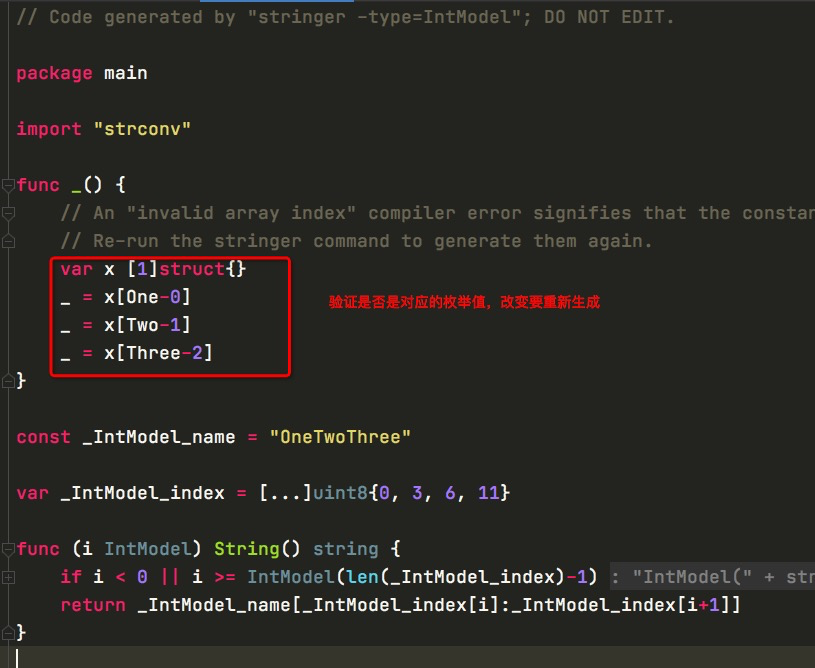
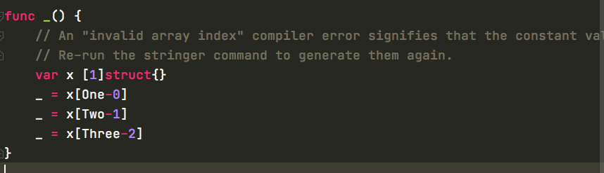

# 作用

`stringer`命令旨在自动创建满足fmt.Stringer的方法。它为指定类型生成`String()`并将其描述为字符串。常可用于定义错误码时同时生成错误信息等场景。

平时开发中我们都会有映射的需求，一般我们这么做

```go
package main

import "fmt"

const (
	One = iota
	Two
	Three
)

//key 和value的映射
var Mp = map[int]string{
	One: "one",
	Two: "two",
	Three: "three",
}

func main(){
	var is int
	is = 1
	if is == Two{
		fmt.Println(Mp[Two])
	}

}
```


输出

```go
-> % go run main.go        
two
```


# 2、stringer

安装

```go
go get golang.org/x/tools/cmd/stringer
```


生成映射文件

```go
stringer -type=IntModel

-rw-r--r--  1 zhangsan  staff   624B Jun 17 13:41 intmodel_string.go
-rw-r--r--  1 zhangsan  staff    92B Jun 17 13:41 main.go
```

`stringer`也可以与生成命令完美配合，使其功能更加强大。只需在代码中添加以下指令即可：

```go
//go:generate stringer -type=IntModel
```

然后，运行`go generate`命令将自动为您的所有类型生成新函数。


```go
Flags:
  -linecomment
        use line comment text as printed text when present
  -output string
        output file name; default srcdir/<type>_string.go
  -tags string
        comma-separated list of build tags to apply
  -trimprefix prefix
        trim the prefix from the generated constant names
  -type string
        comma-separated list of type names; must be set
```

可以指定文件名

我们来看下内容

```go
// Code generated by "stringer -type=IntModel"; DO NOT EDIT.

package main

import "strconv"

func _() {
	// An "invalid array index" compiler error signifies that the constant values have changed.
	// Re-run the stringer command to generate them again.
	var x [1]struct{}
	_ = x[One-0]
	_ = x[Two-1]
	_ = x[Three-2]
}

const _IntModel_name = "OneTwoThree"

var _IntModel_index = [...]uint8{0, 3, 6, 11}

func (i IntModel) String() string {
	if i < 0 || i >= IntModel(len(_IntModel_index)-1) {
		return "IntModel(" + strconv.FormatInt(int64(i), 10) + ")"
	}
	return _IntModel_name[_IntModel_index[i]:_IntModel_index[i+1]]
}
```




# 3、验证

```go
package main

import (
	"fmt"
	"strconv"
)

type IntModel int

const (
	One IntModel = iota
	Two
	Three
)


func main(){
	p := Two
	var is int
	is = 1
	if p == IntModel(is){
		fmt.Println(p)
	}
}

func _() {
	// An "invalid array index" compiler error signifies that the constant values have changed.
	// Re-run the stringer command to generate them again.
	var x [1]struct{}
	_ = x[One-0]
	_ = x[Two-1]
	_ = x[Three-2]
}

const _IntModel_name = "OneTwoThree"

var _IntModel_index = [...]uint8{0, 3, 6, 11}

func (i IntModel) String() string {
	if i < 0 || i >= IntModel(len(_IntModel_index)-1) {
		return "IntModel(" + strconv.FormatInt(int64(i), 10) + ")"
	}
	return _IntModel_name[_IntModel_index[i]:_IntModel_index[i+1]]
}
```


```go
-> % go run main.go
Two
```

在string包中，只要实现了String,fmt.println()就会自动调用String，fmt.Printf也会

# 4、对比

```go
func Switch(i int )string{
	switch i {
	case 0:
		return "one"
	case 1:
		return "two"
	case 2:
		return "three"
	default:
		return ""
	}
}
```


或者if分操作对比发现

这是一个包含二十个值的列表的基准：

```text
name                  time/op
Stringer-4            4.16ns ± 2%
StringerWithSwitch-4  3.81ns ± 1%
```

这是具有一百个值的基准：

```text
name                  time/op
Stringer-4            4.96ns ± 0%
StringerWithSwitch-4  4.99ns ± 1%
```

拥有的常数越多，效率越高。这实际上是有道理的。从内存中加载值比执行一些跳转指令（表示if条件的汇编指令）要耗费更多的时间。但是，switch越大，跳转指令的数量就越大。从某个角度来看，从内存中加载将变得更加有效。

## 自检

在生成的指令中，仅出于验证目的而创建了一些指令。以下是这些说明：




`stringer`将每行的常量名称与该值一起写入。在此示例中，`Aspirin`的值为`2`。更新常量名称或其值将生成错误：

- 更新名称而不重新生成`String()`函数：

- 更新值而不重新生成`String()`函数：

```text
# command-line-arguments
./main.go:30:7: invalid array index One - 0 (out of bounds for 1-element array)
./main.go:31:7: invalid array index Two - 1 (out of bounds for 1-element array)
./main.go:32:7: invalid array index Three - 2 (out of bounds for 1-element array)
```

但是，如果我们添加一个新的常量（这里的下一个键是数字`3`）并且不更新生成的文件，则`stringer`具有默认值：

```text
IntModel(3)
```

添加此自检不会产生任何影响，因为在编译时将其删除。可以通过查看程序生成的asm代码来确认：

```text
➜  go tool compile -S main.go pill_string.go | grep "\"\".IntModel\.[^\s]* STEXT"
"".Pill.String STEXT size=275 args=0x18 locals=0x50
```

只有`String()`函数以二进制形式导出。该检查没有性能或二进制大小的开销。


