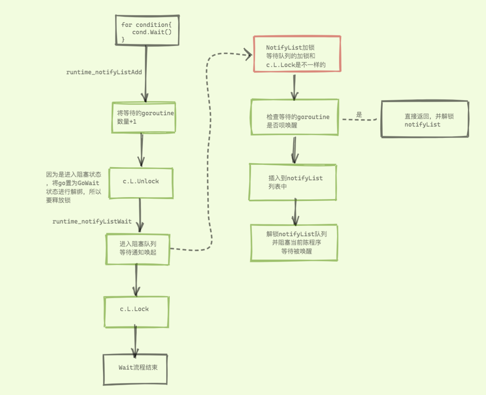
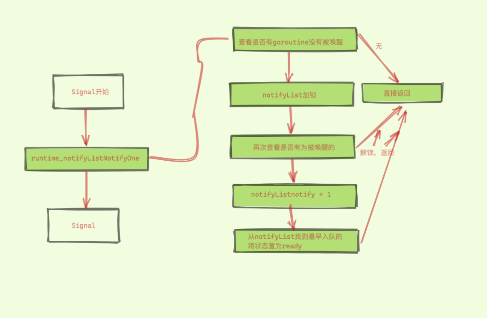
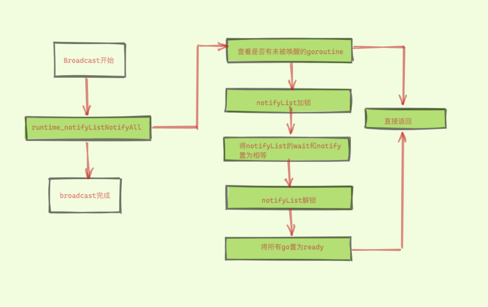
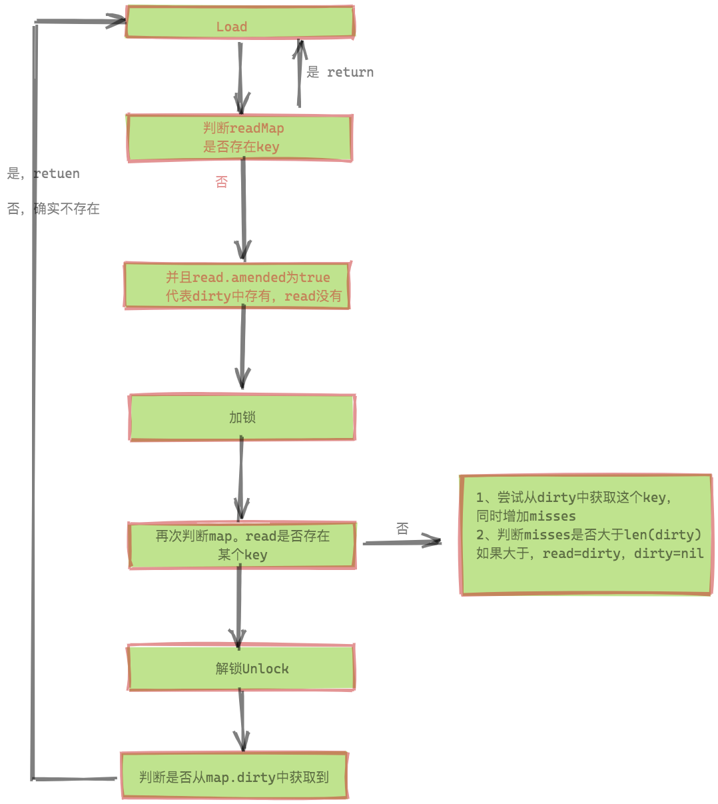
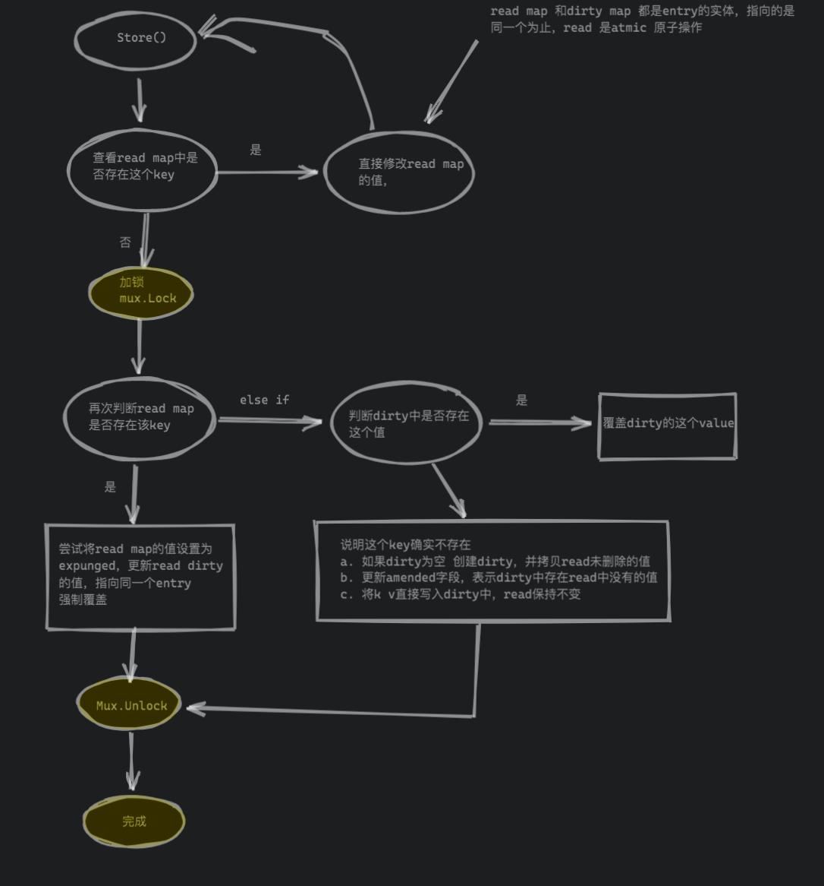
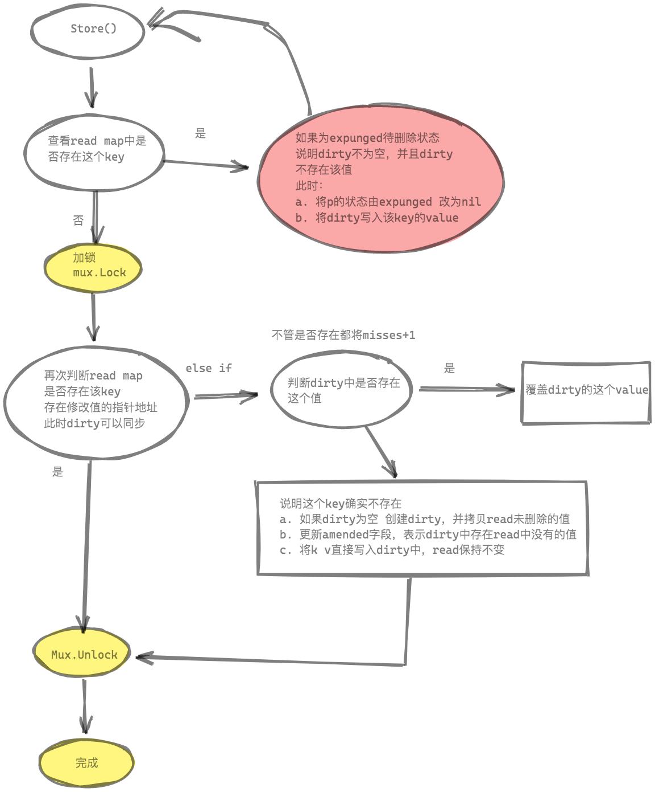

# ==sync.Cond==

## 1、数据结构

```go
//每个cond有一个相关连的Locker（通常实际一个*Mutex或者*RWMutex），当改变条件或者点用wait方法时
//第一次使用后不可以被复制
// Each Cond has an associated Locker L (often a *Mutex or *RWMutex),
// which must be held when changing the condition and
// when calling the Wait method.
//
// A Cond must not be copied after first use.
type Cond struct {
        noCopy noCopy

        // L is held while observing or changing the condition
        L Locker

        notify  notifyList
        checker copyChecker
}
```

## 2、方法汇总

### 2.1 创建一个实例

NewCond 创建 Cond 实例时，需要关联一个锁。
```go
func NewCond(l Locker) *Cond
```

### 2.2 Signal 唤醒一个协程

Signal 只唤醒任意1个等待条件变量c的goroutine，无需锁保护
```go
// Signal wakes one goroutine waiting on c, if there is any.
//
// It is allowed but not required for the caller to hold c.L
// during the call.
func (c *Cond) Signal()
```

### 2.3 唤醒所有协程

```go
// Broadcast wakes all goroutines waiting on c.
//
// It is allowed but not required for the caller to hold c.L
// during the call.
func (c *Cond) Broadcast()
```
Broadcast 唤醒所有等待条件变量c的goroutine，无需锁保护

### 2.4 Wait等待

```go
// Wait atomically unlocks c.L and suspends execution
// of the calling goroutine. After later resuming execution,
// Wait locks c.L before returning. Unlike in other systems,
// Wait cannot return unless awoken by Broadcast or Signal.
//
// Because c.L is not locked when Wait first resumes, the caller
// typically cannot assume that the condition is true when
// Wait returns. Instead, the caller should Wait in a loop:
//
//    c.L.Lock()
//    for !condition() {
//        c.Wait()
//    }
//    ... make use of condition ...
//    c.L.Unlock()
//
func (c *Cond) Wait()
```

注释的意思是，当调用wait的时候，会自动释放c.L,并挂起调用者所在的goroutine，因此当前协程会阻塞在Wait的地方
，当收到Signal或者Broadcast的信号后，那么wait方法在结束阻塞的时候，会调用c.L加锁，并继续执行

还有注释，演示了使用的方法，使用for condition，而不是使用if condition，因为可能第一次没能满足，需要再一次等待下一次唤醒

## 3、基本使用

```go
package main

import (
	"fmt"
	"sync"
	"time"
)

func main() {
	cond := sync.NewCond(&sync.Mutex{})
	var f bool
	go func() {
		time.Sleep(time.Second * 5)
		cond.L.Lock()
		f = true
		cond.L.Unlock()

		cond.Signal()

	}()

	fmt.Println("waiting")

	cond.L.Lock()
	for !f {
		cond.Wait()
	}
	cond.L.Unlock()

	fmt.Println("done")
}
```


## 4、源码流程和实现原理

Wait原理及流程




Signal原理及流程




Broadcast




## 5、问题回顾

### cond.Wait 是阻塞的吗？是如何阻塞的？ 

是阻塞的。不过不是 sleep 这样阻塞的。

调用 `goparkunlock` 解除当前 goroutine 的 m 的绑定关系，将当前 goroutine 状态机切换为等待状态。等待后续 goready 函数时候能够恢复现场。

### cond.Signal 是如何通知一个等待的 goroutine ?

1. 判断是否有没有被唤醒的 goroutine，如果都已经唤醒了，直接就返回了
2. 将已通知 goroutine 的数量加1
3. 从等待唤醒的 goroutine 队列中，获取 head 指针指向的 goroutine，将其重新加入调度
4. 被阻塞的 goroutine 可以继续执行

### cond.Broadcast 是如何通知等待的 goroutine 的？

1. 判断是否有没有被唤醒的 goroutine，如果都已经唤醒了，直接就返回了
2. 将等待通知的 goroutine 数量和已经通知过的 goroutine 数量设置成相等
3. 遍历等待唤醒的 goroutine 队列，将所有的等待的 goroutine 都重新加入调度
4. 所有被阻塞的 goroutine 可以继续执行

### cond.Wait本身就是阻塞状态，为什么 cond.Wait 需要在循环内 ？

我们能注意到，调用 cond.Wait 的位置，使用的是 for 的方式来调用 wait 函数，而不是使用 if 语句。

这是由于 wait 函数被唤醒时，存在虚假唤醒等情况，导致唤醒后发现，条件依旧不成立。因此需要使用 for 语句来循环地进行等待，直到条件成立为止。


### 为什么不能 sync.Cond 不能复制 ？

sync.Cond 不能被复制的原因，并不是因为 sync.Cond 内部嵌套了 Locker。因为 NewCond 时传入的 Mutex/RWMutex 指针，对于 Mutex 指针复制是没有问题的。

主要原因是 sync.Cond 内部是维护着一个 notifyList。如果这个队列被复制的话，那么就在并发场景下导致不同 goroutine 之间操作的 notifyList.wait、notifyList.notify 并不是同一个，这会导致出现有些 goroutine 会一直堵塞。


# ==sync.Map==


## 案例

```go
package main

import (
	"fmt"
	"sync"
)

func main(){
	var m sync.Map

	//数据写入
	fmt.Println("写入操作")
	m.Store("name","zhangsan")
	m.Store("age",23)

	fmt.Println("读取操作")
	//数据读取 ok 存在就是true，不村子啊是false
	name,ok := m.Load("name1")
	fmt.Println(name)
	fmt.Println(ok)

	fmt.Println("遍历操作")
	//便利数据
	m.Range(func(k,v interface{})bool{
		if k == "name"{
			return false
		}
		fmt.Println(k)
		fmt.Println(v)
		return true
	})


	fmt.Println("删除操作")
	//删除
	//m.Delete("age")
	name,ok = m.Load("age")
	fmt.Println(name)
	fmt.Println(ok)

	fmt.Println("读写操作")
	//存在就读取，不存在就插入
	m.LoadOrStore("name","zhangSan")
	name ,ok = m.Load("name")
	fmt.Println(name)
	fmt.Println(ok)


	fmt.Println("获取mlen")

	var i int
	m.Range(func(k,v interface{})bool{
		i ++
		return true
	})
	fmt.Println(i)

	fmt.Println("对比")
	if name ,ok = m.Load("name");ok{
		//if name.(string) =="zhangsan"{
		if name =="zhangsan"{
			fmt.Println("==")
		}else {
			fmt.Println("!=")
		}
	}
	if name ,ok = m.Load("age");ok{
		if name ==23{
			//if name =="zhangsan"{
			fmt.Println(true)
		}else{
			fmt.Println("false")
		}
	}


}
```

```go
写入操作
读取操作
<nil>
false
遍历操作
删除操作
23
true
读写操作
zhangsan
true
获取mlen
2
对比
==
true

```


## 1、数据结构

```go
type Map struct {
	//当写read map 或者读写dirty map时 需要上锁
	mu Mutex

	//read map的 k v（entry）是不变的，删除知识打标记，插入新key的时候会加锁写到dirty中
	read atomic.Value // readOnly

	//dirty map对dirty map的操作需要持有锁
	dirty map[interface{}]*entry

	//当load操作在read map中未找到，尝试从dirty中进行加载时候（不管是否存在），misses+1
	//当misses达到dirty map的len时候，dirty被提升为read 并且重新分配dirty=nil
	misses int
}

// read map数据结构
type readOnly struct {
	m       map[interface{}]*entry
	// 为true时代表dirty map中含有m中没有的元素
	amended bool
}

type entry struct {
	// 指向实际的interface{}
	// p有三种状态:
	// p == nil: 键值已经被删除，此时，m.dirty==nil 或 m.dirty[k]指向该entry
	// p == expunged: 键值已经被删除， 此时, m.dirty!=nil 且 m.dirty不存在该键值
	// 其它情况代表实际interface{}地址 如果m.dirty!=nil 则 m.read[key] 和 m.dirty[key] 指向同一个entry
	// 当删除key时，并不实际删除，先CAS entry.p为nil 等到每次dirty map创建时(dirty提升后的第一次新建Key)，会将entry.p由nil CAS为expunged
	p unsafe.Pointer // *interface{}
}
```

`read map` 和 `dirty map` 的存储方式是不一致的。

前者使用 `atomic.Value`，后者只是单纯的使用 map。原因是 `read map` 使用 `lock free` 操作，必须保证 `load/store` 的原子性；而 `dirty map` 的 `load+store` 操作是由 lock（就是 mu）来保护的。

1. read和dirty通过entry包装value，这样使得value的变化和map的变化隔离，前者可以用atomic无锁完成
2. Map的read字段结构体定义为readOnly，这只是针对map[interface{}]*entry而言的，entry内的内容以及amended字段都是可以变的
3. 大部分情况下，对已有key的删除(entry.p置为nil)和更新可以直接通过修改entry.p来完成


## 2、Load

```go
// Load returns the value stored in the map for a key, or nil if no
// value is present.
// The ok result indicates whether value was found in the map.
func (m *Map) Load(key interface{}) (value interface{}, ok bool) {
	//获取是否存在read中
	read, _ := m.read.Load().(readOnly)
	e, ok := read.m[key]
	//不存在加锁再次获取，为何再次加锁，保证再次获取read和dirty的原子性，也保证此时不会有其他的操作导致dirty的key新增到read中
	if !ok && read.amended {
		m.mu.Lock()
		// Avoid reporting a spurious miss if m.dirty got promoted while we were
		// blocked on m.mu. (If further loads of the same key will not miss, it's
		// not worth copying the dirty map for this key.)
		read, _ = m.read.Load().(readOnly)
		e, ok = read.m[key]
		//判断read.amended 是否为true 为true代表dirty中含有
		if !ok && read.amended {
			e, ok = m.dirty[key]
			// Regardless of whether the entry was present, record a miss: this key
			// will take the slow path until the dirty map is promoted to the read
			// map.
			//将misses加1，并且判断是否比len（dirty）大，
			//大的话直接将dirty提升为read，dirty为nil
			m.missLocked()
		}
		m.mu.Unlock()
	}
	if !ok {
		return nil, false
	}
	//判断获取的p是和否是expunged（删除状态）
	return e.load()
}

func (e *entry) load() (value interface{}, ok bool) {
	p := atomic.LoadPointer(&e.p)
	if p == nil || p == expunged {
		return nil, false
	}
	return *(*interface{})(p), true
}
```

下面我们看下流程图




1. 首先是 fast path，直接在 read 中找，如果找到了直接调用 entry 的 load 方法，取出其中的值。
2. 如果 read 中没有这个 key，且 amended 为 fase，说明 dirty 为空，那直接返回 空和 false。
3. 如果 read 中没有这个 key，且 amended 为 true，说明 dirty 中可能存在我们要找的 key。当然要先上锁，再尝试去 dirty 中查找。在这之前，仍然有一个 double check 的操作。若还是没有在 read 中找到，那么就从 dirty 中找。不管 dirty 中有没有找到，都要"记一笔"，因为在 dirty 被提升为 read 之前，都会进入这条路径


## 3、Store

```go
// Store sets the value for a key.
func (m *Map) Store(key, value interface{}) {
	//读取read map的值，如果存在尝试直接修改，read和dirty指向的都是entry，因此dirty map也可见
	read, _ := m.read.Load().(readOnly)
	if e, ok := read.m[key]; ok && e.tryStore(&value) {
		return
	}

	//不存在咋次加锁读取，保证此时读取的唯一性
	m.mu.Lock()
	read, _ = m.read.Load().(readOnly)
	if e, ok := read.m[key]; ok {
		//如果read map中存在该值，但p==expunged，则说明m.dirty ！= nil，删除操作只能是dirty完成 并且dirty中不存在该key值
		//此时
		//a. 将p的状态由expunged 更改为nil
		// b. dirty map 插入key
		if e.unexpungeLocked() {
			// The entry was previously expunged, which implies that there is a
			// non-nil dirty map and this entry is not in it.
			m.dirty[key] = e
		}
		//更新entry。p = value（read dirty 指向同一个entry）
		e.storeLocked(&value)
	} else if e, ok := m.dirty[key]; ok {
		//走到这 就是read 不存在该值，dirty是存在该值的，直接写入entry（read map）仍然没有这个值
		e.storeLocked(&value)
	} else {
		//如果 read map 和dirty map 都不存在该值，则
		//a. 如果dirty map 为空，则需要创建dirty map ，并从read 中拷贝未删除的元素
		//b. 更新amended字段，标识dirty map中存在read map 中不存在的key
		//c. 将k v 写入dirty中 read 保持不变
		if !read.amended {
			// We're adding the first new key to the dirty map.
			// Make sure it is allocated and mark the read-only map as incomplete.
			m.dirtyLocked()
			m.read.Store(readOnly{m: read.m, amended: true})
		}
		m.dirty[key] = newEntry(value)
	}
	m.mu.Unlock()
}

// tryStore stores a value if the entry has not been expunged.
//
// If the entry is expunged, tryStore returns false and leaves the entry
// unchanged.
func (e *entry) tryStore(i *interface{}) bool {
	for {
		p := atomic.LoadPointer(&e.p)
		if p == expunged {
			return false
		}
		if atomic.CompareAndSwapPointer(&e.p, p, unsafe.Pointer(i)) {
			return true
		}
	}
}

// storeLocked unconditionally stores a value to the entry.
//
// The entry must be known not to be expunged.
func (e *entry) storeLocked(i *interface{}) {
	atomic.StorePointer(&e.p, unsafe.Pointer(i))
}


func (m *Map) dirtyLocked() {
	if m.dirty != nil {
		return
	}

	read, _ := m.read.Load().(readOnly)
	m.dirty = make(map[interface{}]*entry, len(read.m))
	for k, e := range read.m {
		if !e.tryExpungeLocked() {
			m.dirty[k] = e
		}
	}
}

func (e *entry) tryExpungeLocked() (isExpunged bool) {
	p := atomic.LoadPointer(&e.p)
	for p == nil {
		if atomic.CompareAndSwapPointer(&e.p, nil, expunged) {
			return true
		}
		p = atomic.LoadPointer(&e.p)
	}
	return p == expunged
}

```


流程图




1. 首先还是去read map中查询，存在并且p!=expunged,直接修改。（由于修改的是 entry 内部的 pointer，因此 dirty map 也可见）

2. 如果read map中存在该key，但p == expunged。加锁更新p的状态，然后直接更新该entry (此时m.dirtynil或m.dirty[key]e)

3. 如果read map中不存在该Key，但dirty map中存在该key，直接写入更新entry(read map中仍然没有)

4. 如果read map和dirty map都不存在该key

   a. 如果dirty map为空，则需要创建dirty map，并从read map中拷贝未删除的元素

   b. 更新amended字段，标识dirty map中存在read map中没有的key

   c. 将k v写入dirty map中，read.m不变

## 4、delete

```go
// Delete deletes the value for a key.
func (m *Map) Delete(key interface{}) {
	//从read 中查找
	read, _ := m.read.Load().(readOnly)
	e, ok := read.m[key]
	//如果不存在 并且amended为true dirty中存在read中不存在的 
	//加锁 double check 从dirty中删除
	//解锁 返回结果
	if !ok && read.amended {
		m.mu.Lock()
		read, _ = m.read.Load().(readOnly)
		e, ok = read.m[key]
		if !ok && read.amended {
			delete(m.dirty, key)
		}
		m.mu.Unlock()
	}
	if ok {
		e.delete()
	}
}

func (e *entry) delete() (hadValue bool) {
	for {
		p := atomic.LoadPointer(&e.p)
		if p == nil || p == expunged {
			return false
		}
		if atomic.CompareAndSwapPointer(&e.p, p, nil) {
			return true
		}
	}
}
```

删除事比较简单的

看下流程

1. 先去read map中寻找，如果存在就直接删除
2. 如果没找到，并且 read.amended为true代表dirty map中存在，依照传统进行 double check。
3. read map找到就删除，没找到判断dirty map是否存在，存在了就删除


## 5、loadOrStore

```go
func (m *Map) LoadOrStore(key, value interface{}) (actual interface{}, loaded bool) {
	// Avoid locking if it's a clean hit.
	//从read 中读取，如果存在直接修改
	read, _ := m.read.Load().(readOnly)
	if e, ok := read.m[key]; ok {
		actual, loaded, ok := e.tryLoadOrStore(value)
		if ok {
			return actual, loaded
		}
	}

	//如果read 不存在再次 double check
	m.mu.Lock()
	read, _ = m.read.Load().(readOnly)
	if e, ok := read.m[key]; ok {
		//如果此时read 存在，将read设置空，将dirty 置为read的值
		if e.unexpungeLocked() {
			m.dirty[key] = e
		}
		//在修改地址的值置为传入的值
		actual, loaded, _ = e.tryLoadOrStore(value)
	} else if e, ok := m.dirty[key]; ok {
		//如果在read 不存在 在dirty存在，直接修改为value
		actual, loaded, _ = e.tryLoadOrStore(value)
		//将read的misses加1
		m.missLocked()
	} else {
		//都不存在
		//a. 如果dirty为nil new 一个，并从read 未删除的元素
		//b. 更新amended字段，标识dirty map中存在read map不存在
		//c. 将k v 写入dirty map中read不变
		if !read.amended {

			// We're adding the first new key to the dirty map.
			// Make sure it is allocated and mark the read-only map as incomplete.
			m.dirtyLocked()
			m.read.Store(readOnly{m: read.m, amended: true})
		}
		m.dirty[key] = newEntry(value)
		actual, loaded = value, false
	}
	m.mu.Unlock()

	return actual, loaded
}

func (m *Map) dirtyLocked() {
	if m.dirty != nil {
		return
	}

	read, _ := m.read.Load().(readOnly)
	m.dirty = make(map[interface{}]*entry, len(read.m))
	for k, e := range read.m {
		if !e.tryExpungeLocked() {
			m.dirty[k] = e
		}
	}
}

func (e *entry) tryExpungeLocked() (isExpunged bool) {
	p := atomic.LoadPointer(&e.p)
	for p == nil {
		if atomic.CompareAndSwapPointer(&e.p, nil, expunged) {
			return true
		}
		p = atomic.LoadPointer(&e.p)
	}
	return p == expunged
}


// tryLoadOrStore atomically loads or stores a value if the entry is not
// expunged.
//
// If the entry is expunged, tryLoadOrStore leaves the entry unchanged and
// returns with ok==false.
func (e *entry) tryLoadOrStore(i interface{}) (actual interface{}, loaded, ok bool) {
	p := atomic.LoadPointer(&e.p)
	if p == expunged {
		return nil, false, false
	}
	if p != nil {
		return *(*interface{})(p), true, true
	}

	// Copy the interface after the first load to make this method more amenable
	// to escape analysis: if we hit the "load" path or the entry is expunged, we
	// shouldn't bother heap-allocating.
	ic := i
	for {
		if atomic.CompareAndSwapPointer(&e.p, nil, unsafe.Pointer(&ic)) {
			return i, false, true
		}
		p = atomic.LoadPointer(&e.p)
		if p == expunged {
			return nil, false, false
		}
		if p != nil {
			return *(*interface{})(p), true, true
		}
	}
}
```

这个函数结合了 Load 和 Store 的功能，如果 map 中存在这个 key，那么返回这个 key 对应的 value；否则，将 key-value 存入 map。
这在需要先执行 Load 查看某个 key 是否存在，之后再更新此 key 对应的 value 时很有效，因为 LoadOrStore 可以并发执行。

流程图





## 6、总结

1、sync.map 是线程安全的，读取，插入，删除也都保持着常数级的时间复杂度。

2、通过读写分离，降低锁时间来提高效率，适用于读多写少的场景。

3、Range 操作需要提供一个函数，参数是 k,v，返回值是一个布尔值：f func(key, value interface{}) bool。

4、调用 Load 或 LoadOrStore 函数时，如果在 read 中没有找到 key，则会将 misses 值原子地增加 1，当 misses 增加到和 dirty 的长度相等时，会将 dirty 提升为 read。以期减少“读 miss”。

5、新写入的 key 会保存到 dirty 中，如果这时 dirty 为 nil，就会先新创建一个 dirty，并将 read 中未被删除的元素拷贝到 dirty。

6、当 dirty 为 nil 的时候，read 就代表 map 所有的数据；当 dirty 不为 nil 的时候，dirty 才代表 map 所有的数据。

