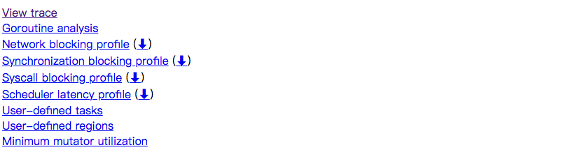
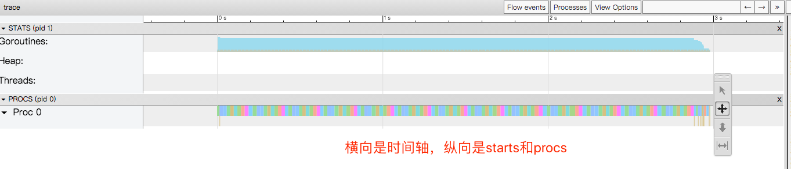

# trace
本文基于go 1.14.2版本

# 代码
```go
/**
 * @Author: zhangSan
 * @Description:
 * @File:  main
 * @Version: 1.0.0
 * @Date: 2021/5/11 下午4:26
 */

package main

import (
	"fmt"
	"os"
	"runtime"
	"runtime/trace"
	"sync"
)

func Sum(w *sync.WaitGroup, i int) {
	defer w.Done()
	var sum, n int64
	for ; n < 1000000000; n++ {
		sum += n
	}
	fmt.Println(i, sum)
}

func main() {
	runtime.GOMAXPROCS(1)

	f, _ := os.Create("./trace.out")
	defer f.Close()

	//开启trace编程
	_ = trace.Start(f)
	defer trace.Stop()

	var w sync.WaitGroup
	for i := 0; i < 10; i++ {
		w.Add(1)
		go Sum(&w, i)
	}
	w.Wait()
}
```

编译
```go
-N 参数代表禁止优化，-l代表禁止关联 -gcflags "all= -N -l -m"
go build -gcflags "-N -l -m"    ./main.go

# command-line-arguments
./main.go:19:10: leaking param: w
./main.go:25:13: ... argument does not escape
./main.go:25:13: i escapes to heap
./main.go:25:13: sum escapes to heap
./main.go:38:6: moved to heap: w
<autogenerated>:1: .this does not escape
```

# 分析trace
```go
go tool trace ./trace.o  
```



View trace：查看跟踪
Goroutine analysis：Goroutine 分析，能看到这段时间所有 goroutine 执行的一个情况，执行堆栈，执行时间；
Network blocking profile：网络阻塞概况（分析网络的一些消耗）
Synchronization blocking profile：同步阻塞概况（分析同步锁的一些情况）
Syscall blocking profile：系统调用阻塞概况（分析系统调用的消耗）
Scheduler latency profile：调度延迟概况（函数的延迟占比）
User defined tasks：自定义任务
User defined regions：自定义区域
Minimum mutator utilization：Mutator 利用率使用情况

## View trace



