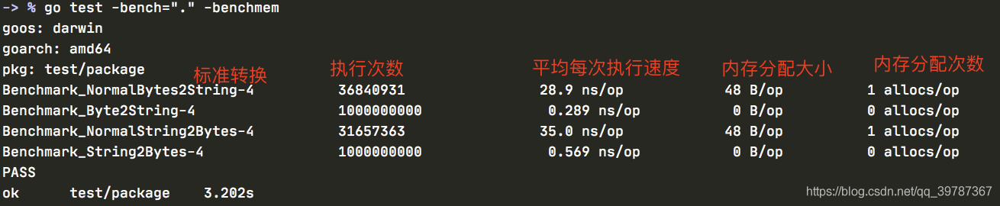
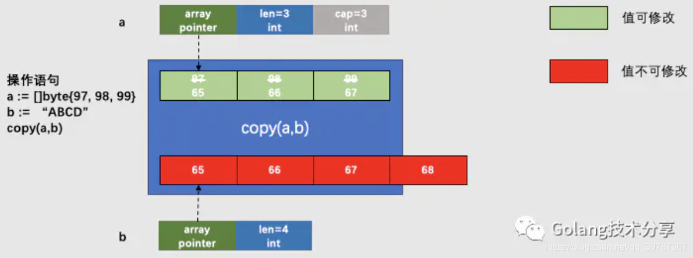

都听说过unsafe和unsafe.Pointer可以相互转换，其实他们也可以跟指针类型转换


- `*T`：普通类型指针类型，用于传递对象地址，不能进行指针运算。
- `unsafe.poniter`：通用指针类型，用于转换不同类型的指针，不能进行指针运算，不能读取内存存储的值(需转换到某一类型的普通指针)
- `uintptr`：用于指针运算，`GC`不把`uintptr`当指针，`uintptr`无法持有对象。`uintptr`类型的目标会被回收。

三者关系就是：`unsafe.Pointer`是桥梁，可以让任意类型的指针实现相互转换，也可以将任意类型的指针转换为`uintptr`进行指针运算，也就说`uintptr`是用来与`unsafe.Pointer`打配合，用于指针运算。画个图表示一下：

# 1、unsafe包
此包只有三个函数
```go
func Sizeof(x ArbitraryType) uintptr

func Offsetof(x ArbitraryType) uintptr

func Alignof(x ArbitraryType) uintptr
```
- Sizeof返回x所占的字节数,==但并不包含`x`所指向的内容的大小==

  ```go
  func main(){
  	fmt.Println("bool类型占用字节数",unsafe.Sizeof(true))
  	fmt.Println("int8类型占用字节数",unsafe.Sizeof(int8(0)))
  	fmt.Println("int16类型占用字节数",unsafe.Sizeof(int16(10)))
  	fmt.Println("int类型占用字节数",unsafe.Sizeof(int(10)))
  	fmt.Println("int32类型占用字节数",unsafe.Sizeof(int32(190)))
  	fmt.Println("string类型占用字节数",unsafe.Sizeof("asong"))
  	fmt.Println("[]int类型占用字节数",unsafe.Sizeof([]int{1,3,4}))
  }
```
  
64系统是8字节
  
  ```go
  bool类型占用字节数 1
  int8类型占用字节数 1
  int16类型占用字节数 2
  int类型占用字节数 8
  int32类型占用字节数 4
  string类型占用字节数 16
  []int类型占用字节数 24
  ```
  
- ==Offetof 主要作用是返回结构体成员在内存中的位置距离结构体起始位置处（结构体的第一个字段的偏移量都是0）的字节数，即偏移量==
```go
  package main
  
  import (
  	"fmt"
  	"unsafe"
  )
  type c struct {
  
  }
  type b struct {
  	namea string
  	//aa int64
  	bb string
  }
  
  type a struct {
  	c
  	b
  	name string
  	age int64
  }
  
  func main(){
  	// Offsetof
	user := User{Name: "zhangsan", Age: 28,Gender: true}
	userNamePointer := unsafe.Pointer(&user)

	nNamePointer := (*string)(unsafe.Pointer(userNamePointer))
	*nNamePointer = "golang技术实验室"

	nAgePointer := (*uint32)(unsafe.Pointer(uintptr(userNamePointer) + unsafe.Offsetof(user.Age)))
	*nAgePointer = 27

	nGender := (*bool)(unsafe.Pointer(uintptr(userNamePointer)+unsafe.Offsetof(user.Gender)))
	*nGender = false

	fmt.Printf("u.Name: %s, u.Age: %d,  u.Gender: %v\n", user.Name, user.Age,user.Gender)
  
  
  }
  
```

  空结构体是不占用字节的

  ```go
 u.Name: golang技术实验室, u.Age: 27,  u.Gender: false
  ```

  

- ==`Alignof(x ArbitratyType)`的主要作用是返回一个类型的对齐值==，也可以叫做对齐系数或者对齐倍数。对齐值是一个和内存对齐有关的值，合理的内存对齐可以提高内存读写的性能。一般对齐值是`2^n`，最大不会超过`8`(受内存对齐影响).获取对齐值还可以使用反射包的函数，也就是说：`unsafe.Alignof(x)`等价于`reflect.TypeOf(x).Align()`。对于任意类型的变量`x`，`unsafe.Alignof(x)`至少为1。对于`struct`结构体类型的变量`x`，计算`x`每一个字段`f`的`unsafe.Alignof(x，f)`，`unsafe.Alignof(x)`等于其中的最大值。对于`array`数组类型的变量`x`，`unsafe.Alignof(x)`等于构成数组的元素类型的对齐倍数。没有任何字段的空`struct{}`和没有任何元素的`array`占据的内存空间大小为`0`，不同大小为`0`的变量可能指向同一块地址。

  ```go
  package main
  
  import (
  	"fmt"
  	"unsafe"
  )
  
  func main(){
  	func_example()
  }
  
  
  func func_example()  {
  	// Alignof
  	var b bool
  	var i8 int8
  	var i16 int16
  	var i64 int64
  	var f32 float32
  	var s string
  	var m map[string]string
  	var p *int32
  	var ps *string
  
  	fmt.Println("bool类型内存对齐",unsafe.Alignof(b))
  	fmt.Println("int8类型内存对齐",unsafe.Alignof(i8))
  	fmt.Println("int16类型内存对齐",unsafe.Alignof(i16))
  	fmt.Println("int64类型内存对齐",unsafe.Alignof(i64))
  	fmt.Println("float32类型内存对齐",unsafe.Alignof(f32))
  	fmt.Println("string类型内存对齐",unsafe.Alignof(s))
  	fmt.Println("map类型内存对齐",unsafe.Alignof(m))
  	fmt.Println("指针类型int32内存对齐",unsafe.Alignof(p))
  	fmt.Println("指针类型string内存对齐",unsafe.Alignof(ps))
  }
  
  bool类型内存对齐 1
  int8类型内存对齐 1
  int16类型内存对齐 2
  int64类型内存对齐 8
  float32类型内存对齐 4
  string类型内存对齐 8
  map类型内存对齐 8
  指针类型int32内存对齐 8
  指针类型string内存对齐 8
  
  ```

# 2、unsafe.Pointer的使用

```go
package main

import (
	"fmt"
	"unsafe"
)

func main(){
	number := 5
	pointer := &number
	fmt.Printf("number:addr:%p, value:%d\n",pointer,*pointer)

	//int 转 float
	float32Number := (*float32)(unsafe.Pointer(pointer))
	*float32Number = *float32Number + 3

	fmt.Printf("float64:addr:%p, value:%f\n",float32Number,*float32Number)

	//int 转 string
	strings := (*string)(unsafe.Pointer(pointer))
	*strings = "klj"
	fmt.Printf("string:addr:%p,value:%s\n",strings,*strings)

	//string 转int
	 ints := (*int64)(unsafe.Pointer(strings))
	 *ints = 64
	fmt.Printf("int:addr:%p,value:%d\n",ints,*ints)


}

```


```go
number:addr:0xc0000b4008, value:5
float64:addr:0xc0000b4008, value:3.000000
string:addr:0xc0000b4008,value:klj
int:addr:0xc0000b4008,value:6
```

我们看到 地址是没有变化的，都是数据类型改变了，改变的同时清空了原来的值，但是看起来感觉很鸡肋，在开发中没有什么用

<font color=red size=5x>**把指针类型转换为unsafe.Pointer类型，然后在转换为任意的类型**</font>


# 3、实际应用场景

## 1、标准转换

go中string与[]byte的互换，相信每一位gopher都能立刻想到以下的转换方式，我们将之称为标准转换。

```
    // string to []byte
    s1 := "hello"
    b := []byte(s1)
    
    // []byte to string
    s2 := string(b)

1234567
```

## 2、强转换

通过unsafe和reflect包，可以实现另外一种转换方式，我们将之称为强转换（也常常被人称作黑魔法）。

```
func String2Bytes(s string) []byte {
    sh := (*reflect.StringHeader)(unsafe.Pointer(&s))
    bh := reflect.SliceHeader{
        Data: sh.Data,
        Len:  sh.Len,
        Cap:  sh.Len,
    }
    return *(*[]byte)(unsafe.Pointer(&bh))
}

func Bytes2String(b []byte) string {
    return *(*string)(unsafe.Pointer(&b))
}
12345678910111213
```

## 3、性能对比

当string 是Hello Gopher！的时候

```
package studys

import (
	"bytes"
	"testing"
)

// 测试强转换功能
func TestBytes2String(t *testing.T) {
	x := []byte("Hello Gopher!")
	y := Bytes2String(x)
	z := string(x)

	if y != z {
		t.Fail()
	}
}

// 测试强转换功能
func TestString2Bytes(t *testing.T) {
	x := "Hello Gopher!"
	y := String2Bytes(x)
	z := []byte(x)

	if !bytes.Equal(y, z) {
		t.Fail()
	}
}

// 测试标准转换string()性能
func Benchmark_NormalBytes2String(b *testing.B) {
	x := []byte("Hello Gopher!")
	for i := 0; i < b.N; i++ {
		_ = string(x)
	}
}

// 测试强转换[]byte到string性能
func Benchmark_Byte2String(b *testing.B) {
	x := []byte("Hello Gopher!")
	for i := 0; i < b.N; i++ {
		_ = Bytes2String(x)
	}
}

// 测试标准转换[]byte性能
func Benchmark_NormalString2Bytes(b *testing.B) {
	x := "Hello Gopher!"
	for i := 0; i < b.N; i++ {
		_ = []byte(x)
	}
}

// 测试强转换string到[]byte性能
func Benchmark_String2Bytes(b *testing.B) {
	x := "Hello Gopher!"
	for i := 0; i < b.N; i++ {
		_ = String2Bytes(x)
	}
}
123456789101112131415161718192021222324252627282930313233343536373839404142434445464748495051525354555657585960
```

结果

```
-> % go test -bench="." -benchmem
goos: darwin
goarch: amd64
pkg: test/package
Benchmark_NormalBytes2String-4          211056076                5.63 ns/op            0 B/op          0 allocs/op
Benchmark_Byte2String-4                 1000000000               0.282 ns/op           0 B/op          0 allocs/op
Benchmark_NormalString2Bytes-4          189172612                6.27 ns/op            0 B/op          0 allocs/op
Benchmark_String2Bytes-4                1000000000               0.565 ns/op           0 B/op          0 allocs/op
PASS
ok      test/package    4.537s

1234567891011
```


可以明显看到
强制转换执行的次数比标准转换次数多，执行速度更快

## 4、测试2

转换字符串 Hello Gopher! Hello Gopher! Hello Gopher!

```
package studys

import (
	"bytes"
	"testing"
)

// 测试强转换功能
func TestBytes2String(t *testing.T) {
	x := []byte("Hello Gopher!")
	y := Bytes2String(x)
	z := string(x)

	if y != z {
		t.Fail()
	}
}

// 测试强转换功能
func TestString2Bytes(t *testing.T) {
	x := "Hello Gopher! Hello Gopher! Hello Gopher!"
	y := String2Bytes(x)
	z := []byte(x)

	if !bytes.Equal(y, z) {
		t.Fail()
	}
}

// 测试标准转换string()性能
func Benchmark_NormalBytes2String(b *testing.B) {
	x := []byte("Hello Gopher! Hello Gopher! Hello Gopher!")
	for i := 0; i < b.N; i++ {
		_ = string(x)
	}
}

// 测试强转换[]byte到string性能
func Benchmark_Byte2String(b *testing.B) {
	x := []byte("Hello Gopher! Hello Gopher! Hello Gopher!")
	for i := 0; i < b.N; i++ {
		_ = Bytes2String(x)
	}
}

// 测试标准转换[]byte性能
func Benchmark_NormalString2Bytes(b *testing.B) {
	x := "Hello Gopher! Hello Gopher! Hello Gopher!"
	for i := 0; i < b.N; i++ {
		_ = []byte(x)
	}
}

// 测试强转换string到[]byte性能
func Benchmark_String2Bytes(b *testing.B) {
	x := "Hello Gopher! Hello Gopher! Hello Gopher!"
	for i := 0; i < b.N; i++ {
		_ = String2Bytes(x)
	}
}

12345678910111213141516171819202122232425262728293031323334353637383940414243444546474849505152535455565758596061
```

结果

```
go test -bench="." -benchmem
goos: darwin
goarch: amd64
pkg: test/package
Benchmark_NormalBytes2String-4          36840931                28.9 ns/op            48 B/op          1 allocs/op
Benchmark_Byte2String-4                 1000000000               0.289 ns/op           0 B/op          0 allocs/op
Benchmark_NormalString2Bytes-4          31657363                35.0 ns/op            48 B/op          1 allocs/op
Benchmark_String2Bytes-4                1000000000               0.569 ns/op           0 B/op          0 allocs/op
PASS
ok      test/package    3.202s
12345678910
```


可以看到

标准转换有内存分配的情况
强制转换执行的次数比标准转换次数多，执行速度更快

## 5、原理分析

## []byte

在go中，byte是uint8的别名，在go标准库builtin中有如下说明：

```
// byte is an alias for uint8 and is equivalent to uint8 in all ways. It is
// used, by convention, to distinguish byte values from 8-bit unsigned
// integer values.
type byte = uint8
1234
在go的源码中src/runtime/slice.go，slice的定义如下：


type slice struct {
    array unsafe.Pointer
    len   int
    cap   int
}
12345678
```

array是底层数组的指针，len表示长度，cap表示容量。对于[]byte来说，array指向的就是byte数组。


## string

关于string类型，在go标准库builtin中有如下说明：

```
// string is the set of all strings of 8-bit bytes, conventionally but not
// necessarily representing UTF-8-encoded text. A string may be empty, but
// not nil. Values of string type are immutable.
type string string
1234
```

翻译过来就是：string是8位字节的集合，通常但不一定代表UTF-8编码的文本。string可以为空，但是不能为nil。string的值是不能改变的。

在go的源码中src/runtime/string.go，string的定义如下：

```
type stringStruct struct {
    str unsafe.Pointer
    len int
}
1234
```

stringStruct代表的就是一个string对象，str指针指向的是某个数组的首地址，len代表的数组长度。那么这个数组是什么呢？我们可以在实例化stringStruct对象时找到答案。

```
//go:nosplit
func gostringnocopy(str *byte) string {
    ss := stringStruct{str: unsafe.Pointer(str), len: findnull(str)}
    s := *(*string)(unsafe.Pointer(&ss))
    return s
}
123456
```

可以看到，入参str指针就是指向byte的指针，那么我们可以确定string的底层数据结构就是byte数组。


综上，string与[]byte在底层结构上是非常的相近（后者的底层表达仅多了一个cap属性，因此它们在内存布局上是可对齐的），这也就是为何builtin中内置函数copy会有一种特殊情况copy(dst []byte, src string) int的原因了。

## 6、区别

对于[]byte与string而言，两者之间最大的区别就是string的值不能改变。这该如何理解呢？下面通过两个例子来说明。

对于[]byte来说，以下操作是可行的：

```
    b := []byte("Hello Gopher!")
    b [1] = 'T'
12
```

string，修改操作是被禁止的：

```
    s := "Hello Gopher!"
    s[1] = 'T'
12
而string能支持这样的操作：
1
    s := "Hello Gopher!"
    s = "Tello Gopher!"
12
```

字符串的值不能被更改，但可以被替换。 string在底层都是结构体stringStruct{str: str_point, len: str_len}，string结构体的str指针指向的是一个字符常量的地址， 这个地址里面的内容是不可以被改变的，因为它是只读的，但是这个指针可以指向不同的地址。

那么，以下操作的含义是不同的：

```
s := "S1" // 分配存储"S1"的内存空间，s结构体里的str指针指向这块内存
s = "S2"  // 分配存储"S2"的内存空间，s结构体里的str指针转为指向这块内存

b := []byte{1} // 分配存储'1'数组的内存空间，b结构体的array指针指向这个数组。
b = []byte{2}  // 将array的内容改为'2'
12345
```


因为string的指针指向的内容是不可以更改的，所以每更改一次字符串，就得重新分配一次内存，**之前分配的空间还需要gc回收，这是导致string相较于[]byte操作低效的根本原因。**

标准转换的实现细节
[]byte(string)的实现（源码在src/runtime/string.go中）

```
// The constant is known to the compiler.
// There is no fundamental theory behind this number.
const tmpStringBufSize = 32

type tmpBuf [tmpStringBufSize]byte

func stringtoslicebyte(buf *tmpBuf, s string) []byte {
    var b []byte
    if buf != nil && len(s) <= len(buf) {
        *buf = tmpBuf{}
        b = buf[:len(s)]
    } else {
        b = rawbyteslice(len(s))
    }
    copy(b, s)
    return b
}

// rawbyteslice allocates a new byte slice. The byte slice is not zeroed.
func rawbyteslice(size int) (b []byte) {
    cap := roundupsize(uintptr(size))
    p := mallocgc(cap, nil, false)
    if cap != uintptr(size) {
        memclrNoHeapPointers(add(p, uintptr(size)), cap-uintptr(size))
    }

    *(*slice)(unsafe.Pointer(&b)) = slice{p, size, int(cap)}
    return
}
1234567891011121314151617181920212223242526272829
```

这里有两种情况：s的长度是否大于32。当大于32时，go需要调用mallocgc分配一块新的内存（大小由s决定），这也就回答了上文中的问题2：当x的数据较大时，标准转换方式会有一次分配内存的操作。
最后通过copy函数实现string到[]byte的拷贝，具体实现在src/runtime/slice.go中的slicestringcopy方法。

```
func slicestringcopy(to []byte, fm string) int {
    if len(fm) == 0 || len(to) == 0 {
        return 0
    }

  // copy的长度取决与string和[]byte的长度最小值
    n := len(fm)
    if len(to) < n {
        n = len(to)
    }

  // 如果开启了竞态检测 -race
    if raceenabled {
        callerpc := getcallerpc()
        pc := funcPC(slicestringcopy)
        racewriterangepc(unsafe.Pointer(&to[0]), uintptr(n), callerpc, pc)
    }
  // 如果开启了memory sanitizer -msan
    if msanenabled {
        msanwrite(unsafe.Pointer(&to[0]), uintptr(n))
    }

  // 该方法将string的底层数组从头部复制n个到[]byte对应的底层数组中去（这里就是copy实现的核心方法，在汇编层面实现 源文件为memmove_*.s）
    memmove(unsafe.Pointer(&to[0]), stringStructOf(&fm).str, uintptr(n))
    return n
}
1234567891011121314151617181920212223242526
```

copy实现过程图解如下

string([]byte)的实现（源码也在src/runtime/string.go中）

```
// Buf is a fixed-size buffer for the result,
// it is not nil if the result does not escape.
func slicebytetostring(buf *tmpBuf, b []byte) (str string) {
    l := len(b)
    if l == 0 {
        // Turns out to be a relatively common case.
        // Consider that you want to parse out data between parens in "foo()bar",
        // you find the indices and convert the subslice to string.
        return ""
    }
  // 如果开启了竞态检测 -race
    if raceenabled {
        racereadrangepc(unsafe.Pointer(&b[0]),
            uintptr(l),
            getcallerpc(),
            funcPC(slicebytetostring))
    }
  // 如果开启了memory sanitizer -msan
    if msanenabled {
        msanread(unsafe.Pointer(&b[0]), uintptr(l))
    }
    if l == 1 {
        stringStructOf(&str).str = unsafe.Pointer(&staticbytes[b[0]])
        stringStructOf(&str).len = 1
        return
    }

    var p unsafe.Pointer
    if buf != nil && len(b) <= len(buf) {
        p = unsafe.Pointer(buf)
    } else {
        p = mallocgc(uintptr(len(b)), nil, false)
    }
    stringStructOf(&str).str = p
    stringStructOf(&str).len = len(b)
  // 拷贝字节数组至字符串
    memmove(p, (*(*slice)(unsafe.Pointer(&b))).array, uintptr(len(b)))
    return
}

// 实例stringStruct对象
func stringStructOf(sp *string) *stringStruct {
    return (*stringStruct)(unsafe.Pointer(sp))
}
1234567891011121314151617181920212223242526272829303132333435363738394041424344
```

可见，当数组长度超过32时，同样需要调用mallocgc分配一块新内存。最后通过memmove完成拷贝。

# 强转换的实现细节

万能的unsafe.Pointer指针
在go中，任何类型的指针*T都可以转换为unsafe.Pointer类型的指针，它可以存储任何变量的地址。同时，unsafe.Pointer类型的指针也可以转换回普通指针，而且可以不必和之前的类型*T相同。另外，unsafe.Pointer类型还可以转换为uintptr类型，该类型保存了指针所指向地址的数值，从而可以使我们对地址进行数值计算。以上就是强转换方式的实现依据。

而string和slice在reflect包中，对应的结构体是reflect.StringHeader和reflect.SliceHeader，它们是string和slice的运行时表达。

```
type StringHeader struct {
    Data uintptr
    Len  int
}

type SliceHeader struct {
    Data uintptr
    Len  int
    Cap  int
}
12345678910
```

内存布局
从string和slice的运行时表达可以看出，除了SilceHeader多了一个int类型的Cap字段，Date和Len字段是一致的。所以，它们的内存布局是可对齐的，这说明我们就可以直接通过unsafe.Pointer进行转换。

[]byte转string图解


string转[]byte图解

Q&A
Q1. 为啥强转换性能会比标准转换好？

对于标准转换，无论是从[]byte转string还是string转[]byte都会涉及底层数组的拷贝。而强转换是直接替换指针的指向，从而使得string和[]byte指向同一个底层数组。这样，当然后者的性能会更好。

Q2. 为啥在上述测试中，当x的数据较大时，标准转换方式会有一次分配内存的操作，从而导致其性能更差，而强转换方式却不受影响？

标准转换时，当数据长度大于32个字节时，需要通过mallocgc申请新的内存，之后再进行数据拷贝工作。而强转换只是更改指针指向。所以，当转换数据较大时，两者性能差距会愈加明显。

Q3. 既然强转换方式性能这么好，为啥go语言提供给我们使用的是标准转换方式？

首先，我们需要知道Go是一门类型安全的语言，而安全的代价就是性能的妥协。但是，性能的对比是相对的，这点性能的妥协对于现在的机器而言微乎其微。另外强转换的方式，会给我们的程序带来极大的安全隐患。

```
a := "hello"
b := String2Bytes(a)
b[0] = 'H'
123
```

a是string类型，前面我们讲到它的值是不可修改的。通过强转换将a的底层数组赋给b，而b是一个[]byte类型，它的值是可以修改的，所以这时对底层数组的值进行修改，将会造成严重的错误（通过defer+recover也不能捕获）。

```
unexpected fault address 0x10b6139
fatal error: fault
[signal SIGBUS: bus error code=0x2 addr=0x10b6139 pc=0x1088f2c]
<u>Q4. 为啥string要设计为不可修改的？</u>
1234
```

我认为有必要思考一下该问题。string不可修改，意味它是只读属性，这样的好处就是：在并发场景下，我们可以在不加锁的控制下，多次使用同一字符串，在保证高效共享的情况下而不用担心安全问题。

取舍场景
在你不确定安全隐患的条件下，尽量采用标准方式进行数据转换。
当程序对运行性能有高要求，同时满足对数据仅仅只有读操作的条件，且存在频繁转换（例如消息转发场景），可以使用强转换。

# 5、内存对齐

内存对齐两大要求

<font color=red size=5x>**对于结构的各个成员，第一个成员位于偏移为0的位置，结构体第一个成员的**偏移量（offset）\**为0，以后每个成员相对于结构体首地址的 offset 都是\**该成员大小与有效对齐值中较小那个**的整数倍，如有需要编译器会在成员之间加上填充字节。**</font>

<font color=red size=5x>**除了结构成员需要对齐，结构本身也需要对齐，结构的长度必须是编译器默认的对齐长度和成员中最长类型中最小的数据大小的倍数对齐。**</font>


<font color=red size=5x>**空`struct`不占用任何存储空间，空 `struct{}` 大小为 0，作为其他 struct 的字段时，一般不需要内存对齐。但是有一种情况除外：即当 `struct{}` 作为结构体最后一个字段时，需要内存对齐。**</font>

现在计算机中内存空间都是按照`byte`划分的，从理论上讲似乎对任何类型的变量的访问可以从任何地址开始，但是实际情况是在访问特定类型变量的时候经常在特定的内存地址访问，这就需要各种类型数据按照一定的规则在空间上排列，而不是顺序的一个接一个的排放，这就对齐。

对齐的作用和原因：`CPU`访问内存时，并不是逐个字节访问，而是以字长（`word size`)单位访问。比如`32`位的`CPU`，字长为`4`字节，那么`CPU`访问内存的单位也是`4`字节。这样设计可以减少`CPU`访问内存的次数，加大`CPU`访问内存的吞吐量。假设我们需要读取8个字节的数据，一次读取`4`个字节那么就只需读取`2`次就可以。内存对齐对实现变量的原子性操作也是有好处的，每次内存访问都是原子的，如果变量的大小不超过字长，那么内存对齐后，对该变量的访问就是原子的，这个特性在并发场景下至关重要。

```go
package main

import (
	"fmt"
	"unsafe"
)
// 64位平台，对齐参数是8
type User1 struct {
	A int32 // 4     8
	B []int32 //24   24
	C string //16    16
	D bool //1       8

}

type User2 struct {
	B []int32 //24    24
	A int32  //4      4
	D bool  //1       4
	C string //16      16
}

type User3 struct {
	D bool//1       8
	B []int32//24   24
	A int32//4      4 + 4
	C string//16    16
}

func main()  {
	var u1 User1
	var u2 User2
	var u3 User3

	fmt.Println("u1 size is ",unsafe.Sizeof(u1))
	fmt.Println("u2 size is ",unsafe.Sizeof(u2))
	fmt.Println("u3 size is ",unsafe.Sizeof(u3))
}
```


```go
u1 size is  80
u2 size is  72
u3 size is  80
```

我们现在来分析一下上面的例子，根据我的`mac`使用的64位`CPU`,对齐参数是8来分析，`int32`、`[]int32`、`string`、`bool`对齐值分别是`4`、`8`、`8`、`1`，占用内存大小分别是`4`、`24`、`16`、`1`，我们先根据第一条对齐规则分析`User3`

D bool类型对齐值为1，但是B是24，不足8位，B从第9位开始，D补齐4位是8
A 是4位 C是16，A补齐4位 是8

8 + 24 + 8+ 16 = 56

# 6、 结构体注意点

==对于内存对齐这里还有一最后需要注意的知识点，空`struct`不占用任何存储空间，空 `struct{}` 大小为 0，作为其他 struct 的字段时，一般不需要内存对齐。==<font color=red size=5x>**但是有一种情况除外：即当 `struct{}` 作为结构体最后一个字段时，需要内存对齐。因为如果有指针指向该字段, 返回的地址将在结构体之外，如果此指针一直存活不释放对应的内存，就会有内存泄露的问题（==该内存不因结构体释放而释放==）。**</font>来看一个例子：

```go
package main

import (
	"fmt"
	"unsafe"
)
func main()  {
	fmt.Println(unsafe.Sizeof(test1{})) // 8
	fmt.Println(unsafe.Sizeof(test2{})) // 4
}
type test1 struct {
	a int32
	b struct{}
}

type test2 struct {
	a struct{}
	b int32
}

```

简单来说，对于任何占用0大小空间的类型，像`struct {}`或者`[0]byte`这些，如果该类型出现在结构体末尾，那么我们就假设它占用1个字节的大小。因此对于`test1`结构体，他看起来就是这样：`

```
type test1 struct {
 a int32
// b struct{}
  b [1]byte
}
```

因此在内存对齐时，最后结构体占用的字节就是8了。

==**重点要注意的问题：不要在结构体定义的最后添加零大小的类型**==

