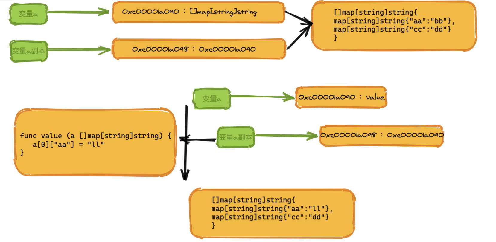

# 1、值传递
值传递表面意思就是传递的是值，函数调用传递的总是这个值的副本，接收的地址和原来值的地址是不一样的
我们来看个例子
```go
package main

import "fmt"

func main(){
	//值传递
	var a int64 = 10
	fmt.Printf("地址是：%p\n",&a)
	value(a)
}

func value(a int64){
	fmt.Printf("地址是：%p\n",&a)

}
```
```go
地址是：0xc00001a090
地址是：0xc00001a098
```
我们来画个图看下


# 2、引用传递
    引用传递就是在函数传递的过程中，传递的是原来变量的地址，修改变量就会改变原来的值，C++就是如此

# ==3、go中是值传递==
下面我们来看go的几个类型的传递是什么

## 1、int系列是基本类型--值传递
```go
package main

import "fmt"

func main(){
	//值传递
	var a int64 = 10
	fmt.Printf("地址是：%p\n",&a)
	value(a)
}

func value(a int64){
	fmt.Printf("地址是：%p\n",&a)

}
```
```go
地址是：0xc00001a090
地址是：0xc00001a098
```

## 2、字符串类型
```go
package main

import "fmt"

func main(){

	//值传递
	var a int64 = 10
	var  b string = "kl"
	fmt.Printf("int a 地址是：%p\n",&a)
	fmt.Printf("string b  地址是：%p\n",&b)
	value(a,b)
}

func value(a int64,b string ){
	fmt.Printf("int a 地址是：%p\n",&a)
	fmt.Printf("string b  地址是：%p\n",&b)


}

```

```go
int a 地址是：0xc00001a090
string b  地址是：0xc000010200
int a 地址是：0xc00001a098
string b  地址是：0xc000010210
```
## 2、slice系列
通过案例我们可以看出，golang的slice也是值传递，只不过传递的是地址这个值
我们修改了map的值，但是原来的地址的值却改变了，这是怎么回事，我们画图看下

```go
package main

import "fmt"

func main(){

	//值传递
	var a []map[string]string= []map[string]string{map[string]string{"aa":"bb"},map[string]string{"cc":"dd"}}
	fmt.Printf("1slice map  地址是：%p,value:%v\n",&a,a)
	value(a)
	fmt.Printf("2slice map  地址是：%p,value:%v\n",&a,a)


}

func value(a []map[string]string ){
	fmt.Printf("3slice map  地址是：%p,value:%v\n",&a,a)
	a[0]["aa"] = "ll"
	fmt.Printf("4slice map  地址是：%p,value:%v\n",&a,a)


}


```
```go
1slice map  地址是：0xc00000c080,value:[map[aa:bb] map[cc:dd]]
3slice map  地址是：0xc00000c180,value:[map[aa:bb] map[cc:dd]]
4slice map  地址是：0xc00000c180,value:[map[aa:ll] map[cc:dd]]
2slice map  地址是：0xc00000c080,value:[map[aa:ll] map[cc:dd]]
```



从图中可以看出，虽然传递的是值的拷贝，但是地址都是指向同一个变量的，后续的修改都是操作同一个地址的值

我们看一下slice底层结构：
```go

//runtime/slice.go
type slice struct {
array unsafe.Pointer
len   int
cap   int
}
```
slice是一个结构体，他的第一个元素是一个指针类型，这个指针指向的是底层数组的第一个元素。所以当是slice类型的时候，fmt.Printf返回是slice这个结构体里第一个元素的地址。说到底，又转变成了指针处理，只不过这个指针是slice中第一个元素的内存地址。

说了这么多，最后再做一个总结吧，为什么slice也是值传递。之所以对于引用类型的传递可以修改原内容的数据，这是因为在底层默认使用该引用类型的指针进行传递，但也是使用指针的副本，依旧是值传递。所以slice传递的就是第一个元素的指针的副本，因为fmt.printf缘故造成了打印的地址一样，给人一种混淆的感觉。

## 4、map类型
```go
package main

import "fmt"

func main(){

	//值传递
	var a map[string]string= map[string]string{"aa":"bb","cc":"dd"}
	fmt.Printf("1 map  地址是：%p,value:%v\n",&a,a)
	value(a)
	fmt.Printf("2 map  地址是：%p,value:%v\n",&a,a)


}

func value(a map[string]string ){
	fmt.Printf("3 map  地址是：%p,value:%v\n",&a,a)
	a["aa"] = "ll"
	fmt.Printf("4 map  地址是：%p,value:%v\n",&a,a)
}
```

```go
1 map  地址是：0xc00000e028,value:map[aa:bb cc:dd]
3 map  地址是：0xc00000e038,value:map[aa:bb cc:dd]
4 map  地址是：0xc00000e038,value:map[aa:ll cc:dd]
2 map  地址是：0xc00000e028,value:map[aa:ll cc:dd]
```

可以看出map也是如此，函数调用传递的是地址的拷贝，但是指向同一个值

```go
//src/runtime/map.go
// makemap implements Go map creation for make(map[k]v, hint).
// If the compiler has determined that the map or the first bucket
// can be created on the stack, h and/or bucket may be non-nil.
// If h != nil, the map can be created directly in h.
// If h.buckets != nil, bucket pointed to can be used as the first bucket.
func makemap(t *maptype, hint int, h *hmap) *hmap {
mem, overflow := math.MulUintptr(uintptr(hint), t.bucket.size)
if overflow || mem > maxAlloc {
hint = 0
}

// initialize Hmap
if h == nil {
h = new(hmap)
}
h.hash0 = fastrand()
```
从以上源码，我们可以看出，使用make函数返回的是一个hmap类型的指针*hmap。回到上面那个例子，我们的func modifiedAge(person map[string]int)函数，其实就等于func modifiedAge(person *hmap）,实际上在作为传递参数时还是使用了指针的副本进行传递，属于值传递。在这里，Go语言通过make函数，字面量的包装，为我们省去了指针的操作，让我们可以更容易的使用map。这里的map可以理解为引用类型，但是记住引用类型不是传引用。

## 5、chan
```go
package main

import (
	"fmt"
	"time"
)

func main(){

	p:=make(chan bool)
	fmt.Printf("原始chan的内存地址是：%p\n",&p)
	go func(p chan bool){
		fmt.Printf("函数里接收到chan的内存地址是：%p\n",&p)
		//模拟耗时
		time.Sleep(2*time.Second)
		p<-true
	}(p)

	select {
	case l := <- p:
		fmt.Println(l)
	}


}


```

```go
原始chan的内存地址是：0xc000124018
函数里接收到chan的内存地址是：0xc000124028
```
```go
看到chan也是一样
这个怎么回事，实参与形参地址不一样，但是这个值是怎么传回来的，说好的值传递呢？白着急，铁子，我们像分析map那样，再来分析一下chan。首先看源码：

// src/runtime/chan.go
func makechan(t *chantype, size int) *hchan {
elem := t.elem

// compiler checks this but be safe.
if elem.size >= 1<<16 {
throw("makechan: invalid channel element type")
}
if hchanSize%maxAlign != 0 || elem.align > maxAlign {
throw("makechan: bad alignment")
}

mem, overflow := math.MulUintptr(elem.size, uintptr(size))
if overflow || mem > maxAlloc-hchanSize || size < 0 {
panic(plainError("makechan: size out of range"))
}
```
从以上源码，我们可以看出，使用make函数返回的是一个hchan类型的指针*hchan。这不是与map一个道理嘛，再次回到上面的例子，实际我们的fun (p chan bool)与fun (p *hchan)是一样的，实际上在作为传递参数时还是使用了指针的副本进行传递，属于值传递。

## 6、struct

```go
package main

import "fmt"
type Person struct {
	Name string
	Age int64
}

func main()  {
	p := Person{
		Name: "zhangsan",
		Age: int64(8),
	}
	fmt.Printf("原始struct地址是：%p\n",&p)
	modifiedAge(p)
	fmt.Println(p)
}


func modifiedAge(p Person)  {
	fmt.Printf("函数里接收到struct的内存地址是：%p\n",&p)
	p.Age = 10
}

```
意外不意外，struct是基本类型，不是引用类型

## 总结下
<font color=red size=5x>**Go语言中所有的传参都是值传递（传值），都是一个副本，一个拷贝。因为拷贝的内容有时候是非引用类型（int、string、struct等这些），这样就在函数中就无法修改原内容数据；有的是引用类型（指针、map、sl**ice、chan等这些），这样就可以修改原内容数据。**</font>

