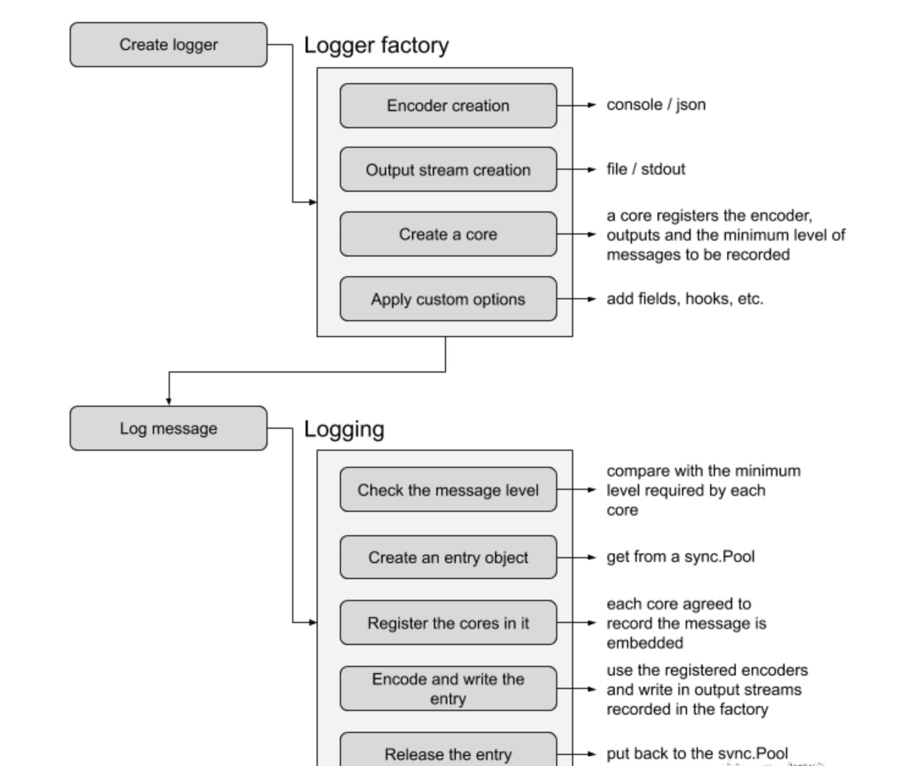

# zap操作流程




优势
- 避免 interface{} 使用强类型设计
- 封装强类型，无反射
- 使用零分配内存的 JSON 编码器，尽可能避免序列化开销，它比其他结构化日志包快 4 - 10 倍。
```go
logger.Info("failed to fetch URL",
  zap.String("url", "https://baidu.com"),
  zap.Int("attempt", 3),
  zap.Duration("backoff", time.Second),
)
```
- 使用 sync.Pool 以避免记录消息时的内存分配


Zap 提供了两种类型的 logger

- SugaredLogger
- Logger

在**性能良好但不是关键**的情况下，使用 **SugaredLogger**，它比其他结构化的日志包快 4-10 倍，并且支持结构化和 `printf` 风格的APIs。

# 2、安装

```go
go get -u go.uber.org/zap
```


# 3、案例

```go
package main

import (
	"go.uber.org/zap"
	"time"
)

func main(){
	//interface()类型的数据
	Sugar()

	//请类型字段
	Logger()

}


/**
* interface{}类型的转化
**/
func Sugar(){
	logger, _ := zap.NewProduction()
	// 默认 logger 不缓冲。
	// 但由于底层 api 允许缓冲，所以在进程退出之前调用 Sync 是一个好习惯。
	defer logger.Sync()
	sugar := logger.Sugar()
	sugar.Infof("message: %s", "https://github.com")

}

/**
* 对性能和类型安全要求严格的情况下，可以使用 Logger ，
* 它甚至比前者SugaredLogger更快，内存分配次数也更少，
* 但它仅支持强类型的结构化日志记录。
*/
func Logger(){
	logger, _ := zap.NewDevelopment()
	defer logger.Sync()
	logger.Info("failed to fetch URL",
		// 强类型字段
		zap.String("url", "https://github.com"),
		zap.Int("int", 3),
		zap.Duration("total", time.Second),
	)

	//二进制 zap.Binary
	//time zap.Time
}
```


```go
{"level":"info","ts":1623842315.13313,"caller":"zap/main.go:27","msg":"message: https://github.com"}
```

```go
2021-06-16T19:18:35.133+0800    INFO    zap/main.go:39  failed to fetch URL     {"url": "https://github.com", "int": 3, "total": "1s"}
```


 Sugar()是SugaredLogger的类型，可以不置顶存储的类型，而Logger()是要指定村处的数据类型的


# 4、自定义消息体

```go
func ZdyMessageType(){
	atom := zap.NewAtomicLevelAt(zap.DebugLevel)
	core := zapcore.NewCore(
		zapcore.NewConsoleEncoder(NewCustomEncoderConfig()),
		zapcore.NewMultiWriteSyncer(zapcore.AddSync(os.Stdout)),
		atom,
	)
	logger := zap.New(core, zap.AddCaller(), zap.Development())
	defer logger.Sync()

	// 配置 zap 包的全局变量
	zap.ReplaceGlobals(logger)

	// 运行时安全地更改 logger 日记级别
	atom.SetLevel(zap.InfoLevel)
	sugar := logger.Sugar()
	// 问题 1: debug 级别的日志打印到控制台了吗?
	sugar.Debug("debug")
	sugar.Info("info")
	sugar.Warn("warn")
	sugar.DPanic("dPanic")
	// 问题 2: 最后的 error 会打印到控制台吗?
	sugar.Error("error")
}

func NewCustomEncoderConfig() zapcore.EncoderConfig{
		return zapcore.EncoderConfig{
		TimeKey:        "ts",
		LevelKey:       "level",
		NameKey:        "logger",
		CallerKey:      "caller",
		FunctionKey:    zapcore.OmitKey,
		MessageKey:     "msg",
		StacktraceKey:  "stacktrace",
		LineEnding:     zapcore.DefaultLineEnding,
		EncodeLevel:    zapcore.CapitalColorLevelEncoder,
		EncodeTime:     zapcore.TimeEncoderOfLayout("2006-01-02 15:04:05"),
		EncodeDuration: zapcore.SecondsDurationEncoder,
		EncodeCaller:   zapcore.ShortCallerEncoder,
	}
}
```

```go
-> % go run main.go
2021-06-16 19:28:14     INFO    zap/main.go:73  info
2021-06-16 19:28:14     WARN    zap/main.go:74  warn
2021-06-16 19:28:14     DPANIC  zap/main.go:75  dPanic
panic: dPanic

goroutine 1 [running]:
go.uber.org/zap/zapcore.(*CheckedEntry).Write(0xc0000f20c0, 0x0, 0x0, 0x0)
        /Users/zhangsan/Documents/GitHub/testCode/vendor/go.uber.org/zap/zapcore/entry.go:234 +0x566
go.uber.org/zap.(*SugaredLogger).log(0xc000107dd0, 0xc000098e03, 0x0, 0x0, 0xc000107df0, 0x1, 0x1, 0x0, 0x0, 0x0)
        /Users/zhangsan/Documents/GitHub/testCode/vendor/go.uber.org/zap/sugar.go:227 +0x119
go.uber.org/zap.(*SugaredLogger).DPanic(...)
        /Users/zhangsan/Documents/GitHub/testCode/vendor/go.uber.org/zap/sugar.go:118
main.ZdyMessageType()
        /Users/zhangsan/Documents/GitHub/testCode/zap/main.go:75 +0x51a
main.main()
        /Users/zhangsan/Documents/GitHub/testCode/zap/main.go:18 +0x20
exit status 2
```


我们可以看到debug的级别的没有打印到控制台，我们可以通过atom.SetLevel设置日志登记来控制是否打印到控制台

error类型的野没有打印到控制台，因为我们 `zap.Development()` 启用了开发模式，在开发模式下 `DPanic` 函数会引发 panic，所以最后的 `error` 不会打印到控制台。


# 5、写入文件

zap 不支持文件归档，如果要支持文件按大小或者时间归档，需要使用lumberjack，lumberjack也是[zap官方推荐](https://github.com/uber-go/zap/blob/master/FAQ.md)的。

```go
hook := lumberjack.Logger{
		Filename:   "./logs/spikeProxy1.log", // 日志文件路径
		MaxSize:    128,                      // 每个日志文件保存的最大尺寸 单位：M
		MaxBackups: 30,                       // 日志文件最多保存多少个备份
		MaxAge:     7,                        // 文件最多保存多少天
		Compress:   true,                     // 是否压缩
	}

	encoderConfig := zapcore.EncoderConfig{
		TimeKey:        "time",
		LevelKey:       "level",
		NameKey:        "logger",
		CallerKey:      "linenum",
		MessageKey:     "msg",
		StacktraceKey:  "stacktrace",
		LineEnding:     zapcore.DefaultLineEnding,
		EncodeLevel:    zapcore.LowercaseLevelEncoder,  // 小写编码器
		EncodeTime:     zapcore.ISO8601TimeEncoder,     // ISO8601 UTC 时间格式
		EncodeDuration: zapcore.SecondsDurationEncoder, //
		EncodeCaller:   zapcore.FullCallerEncoder,      // 全路径编码器
		EncodeName:     zapcore.FullNameEncoder,
	}

	// 设置日志级别
	atomicLevel := zap.NewAtomicLevel()
	atomicLevel.SetLevel(zap.InfoLevel)

	core := zapcore.NewCore(
		zapcore.NewJSONEncoder(encoderConfig),                                           // 编码器配置
		zapcore.NewMultiWriteSyncer(zapcore.AddSync(os.Stdout), zapcore.AddSync(&hook)), // 打印到控制台和文件
		atomicLevel,                                                                     // 日志级别
	)

	// 开启开发模式，堆栈跟踪
	caller := zap.AddCaller()
	// 开启文件及行号
	development := zap.Development()
	// 设置初始化字段
	filed := zap.Fields(zap.String("serviceName", "serviceName"))
	// 构造日志
	logger := zap.New(core, caller, development, filed)

	logger.Info("log 初始化成功")
	logger.Info("无法获取网址",
		zap.String("url", "http://www.baidu.com"),
		zap.Int("attempt", 3),
		zap.Duration("backoff", time.Second))
```

```go
-> % tail -f logs/spikeProxy1.log                                                 
{"level":"info","time":"2021-06-16T19:44:39.644+0800","linenum":"/Users/zhangsan/Documents/GitHub/testCode/zap/main.go:143","msg":"log 初始化成功","serviceName":"serviceName"}
{"level":"info","time":"2021-06-16T19:44:39.645+0800","linenum":"/Users/zhangsan/Documents/GitHub/testCode/zap/main.go:144","msg":"无法获取网址","serviceName":"serviceName","url":"http://www.baidu.com","attempt":3,"backoff":1}
```


# 6、按时间分割日志

如果需要按照时间来分隔日志，我们在写入日志的时候初始化全局的变量，每次写入的时候判断是否和当前时间，天、月、时、分等一致