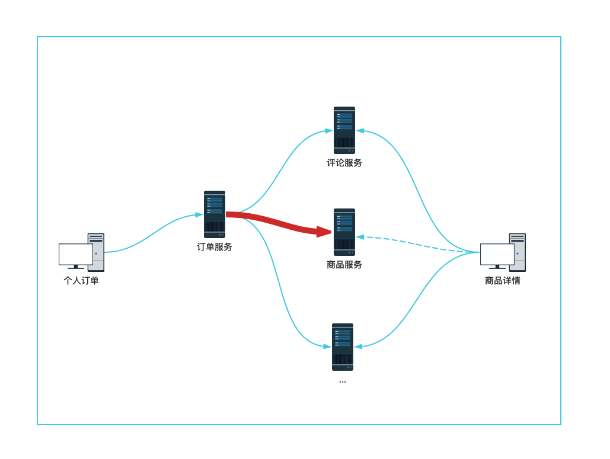
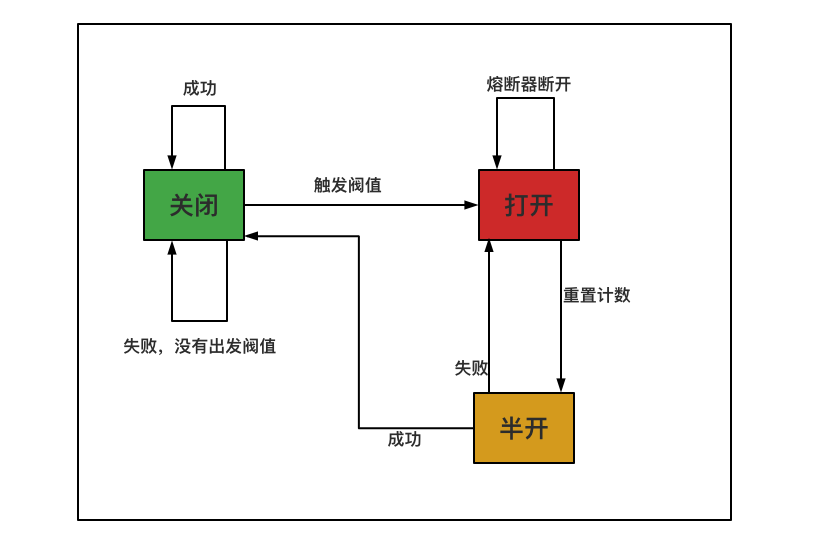
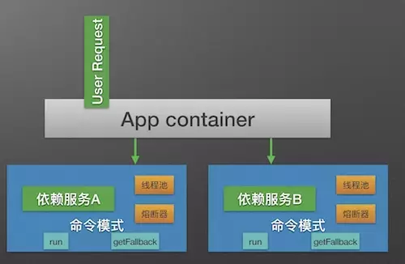
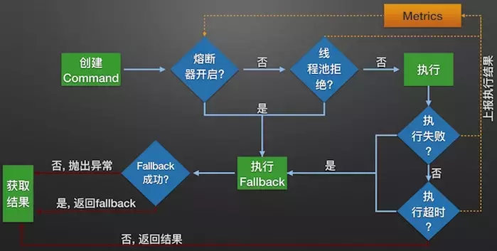

# 熔断器

## 常见业务场景



如图，个人订单查看和商品详情的展示

当前服务系统都是微服务，模块之间的调用联系紧密。

1. 商品模块是做了限流的操作，可以扛住一定的压力，但是拒绝请求还是有成本的。
2. 假设商品服务可以扛住1w的rps，加了限流可以支撑在10wrps的情况下仍然提供1w的rps的有效请求，但是流量再翻10倍
   ，来到100万的时候，可能商品服务的限流服务也是撑不住的。

如图，当订单服务涌入大量请求，即使商品服务有限流策略，但是当请求到达一定数量级的时候，还是会影响商品详情的请求

针对这种情况，==不仅仅是服务端做好限流服务，客户端（调用者）也应该做好对应的熔断策略，避免瞬时流量对下游服务的冲击，从而
影响其他服务，导致服务雪崩，系统瘫痪。==


## 熔断器状态转换



服务的健康状况 = 请求失败数 / 请求总数.

熔断器开关由关闭到打开的状态转换是通过当前服务健康状况和设定阈值比较决定的.

1. 当熔断器开关关闭时, 请求被允许通过熔断器. 如果当前健康状况高于设定阈值, 开关继续保持关闭. 如果当前健康状况低于设定阈值, 开关则切换为打开状态.
2. 当熔断器开关打开时, 请求被禁止通过.
3. 当熔断器开关处于打开状态, 经过一段时间后, 熔断器会自动进入半开状态, 这时熔断器只允许一个请求通过. 当该请求调用成功时, 熔断器恢复到关闭状态. 若该请求失败, 熔断器继续保持打开状态, 接下来的请求被禁止通过.

==熔断器的开关能保证服务调用者在调用异常服务时, 快速返回结果, 避免大量的同步等待. 并且熔断器能在一段时间后继续侦测请求执行结果, 提供恢复服务调用的可能。==

命令模式

Hystrix使用命令模式(继承HystrixCommand类)来包裹具体的服务调用逻辑(run方法), 并在命令模式中添加了服务调用失败后的降级逻辑(getFallback).

同时我们在Command的构造方法中可以定义当前服务线程池和熔断器的相关参数.

在使用了Command模式构建了服务对象之后, 服务便拥有了熔断器和线程池的功能.



## Hystrix的内部处理逻辑

下图为Hystrix服务调用的内部逻辑:



1. 构建Hystrix的Command对象, 调用执行方法.
2. Hystrix检查当前服务的熔断器开关是否开启, 若开启, 则执行降级服务getFallback方法.
3. 若熔断器开关关闭, 则Hystrix检查当前服务的线程池是否能接收新的请求, 若超过线程池已满, 则执行降级服务getFallback方法.
4. 若线程池接受请求, 则Hystrix开始执行服务调用具体逻辑run方法.
5. 若服务执行失败, 则执行降级服务getFallback方法, 并将执行结果上报Metrics更新服务健康状况.
6. 若服务执行超时, 则执行降级服务getFallback方法, 并将执行结果上报Metrics更新服务健康状况.
7. 若服务执行成功, 返回正常结果.
8. 若服务降级方法getFallback执行成功, 则返回降级结果.
9. 若服务降级方法getFallback执行失败, 则抛出异常.


# 使用

## 启动服务

```go
package main

import (
	"io"
	"log"
	"net/http"
)

func main() {
	http.HandleFunc("/hello",helloServer)
	log.Fatal(http.ListenAndServe(":18080",nil))
}


func helloServer(w http.ResponseWriter, req *http.Request) {
	log.Println("request remote addr",req.RemoteAddr)
	io.WriteString(w, "hello,world")
}
```


## 同步请求

```go
package main

import (
	"log"
	"time"
	"errors"
	"io/ioutil"
	"net/http"

	"github.com/afex/hystrix-go/hystrix"
)

func main() {
	httpURL := "http://localhost:18080/hello"

	//初始化hystrix配置
	hystrix.ConfigureCommand("svc1", hystrix.CommandConfig{
		// 执行 command 的超时时间
		Timeout: 10,

		// 最大并发量
		MaxConcurrentRequests: 5,

		// 一个统计窗口 10 秒内请求数量
		// 达到这个请求数量后才去判断是否要开启熔断
		RequestVolumeThreshold: 5,

		// 熔断器被打开后
		// SleepWindow 的时间就是控制过多久后去尝试服务是否可用了
		// 单位为毫秒
		SleepWindow: 500,

		// 错误百分比
		// 请求数量大于等于 RequestVolumeThreshold 并且错误率到达这个百分比后就会启动熔断
		ErrorPercentThreshold: 20,
	})


	for i := 0 ; i < 10 ; i++ {
		for j := 0 ; j< 10 ; j++ {
			go func() {
				req,err := httpDo(httpURL)
				if err != nil {
					log.Println("http request error :",err.Error())
				}else {
					log.Println("http request success:",string(req))
				}
			}()
		}
		time.Sleep(time.Second*5)
	}

}

//http请求
func httpDo(url string) (respBytes []byte, err error) {
	var resp *http.Response
	err = hystrix.Do("svc1",func() error {
		resp,err = http.Get(url)
		if err != nil {
			return err
		}
		respBytes,err = ioutil.ReadAll(resp.Body)
		if err !=nil {
			return err
		}

		return nil
	}, func(error) error {
		return errors.New("http request error")
	})

	return
}
```


```go
2021/07/24 09:49:04 http request error : fallback failed with 'http request error'. run error was 'hystrix: max concurrency'
2021/07/24 09:49:04 http request error : fallback failed with 'http request error'. run error was 'hystrix: max concurrency'
2021/07/24 09:49:04 http request error : fallback failed with 'http request error'. run error was 'hystrix: max concurrency'
2021/07/24 09:49:04 http request error : fallback failed with 'http request error'. run error was 'hystrix: max concurrency'
2021/07/24 09:49:04 http request error : fallback failed with 'http request error'. run error was 'hystrix: max concurrency'
2021/07/24 09:49:04 http request success: hello,world
2021/07/24 09:49:04 http request success: hello,world
2021/07/24 09:49:04 http request success: hello,world
2021/07/24 09:49:04 http request success: hello,world
2021/07/24 09:49:04 http request success: hello,world
2021/07/24 09:49:09 http request error : fallback failed with 'http request error'. run error was 'hystrix: circuit open'
2021/07/24 09:49:09 http request error : fallback failed with 'http request error'. run error was 'hystrix: circuit open'
2021/07/24 09:49:09 http request error : fallback failed with 'http request error'. run error was 'hystrix: circuit open'
2021/07/24 09:49:09 http request error : fallback failed with 'http request error'. run error was 'hystrix: circuit open'
2021/07/24 09:49:09 http request error : fallback failed with 'http request error'. run error was 'hystrix: circuit open'
2021/07/24 09:49:09 http request error : fallback failed with 'http request error'. run error was 'hystrix: circuit open'
2021/07/24 09:49:09 http request error : fallback failed with 'http request error'. run error was 'hystrix: circuit open'
2021/07/24 09:49:09 http request error : fallback failed with 'http request error'. run error was 'hystrix: circuit open'
2021/07/24 09:49:09 http request error : fallback failed with 'http request error'. run error was 'hystrix: circuit open'
2021/07/24 09:49:09 http request error : fallback failed with 'http request error'. run error was 'hystrix: circuit open'
2021/07/24 09:49:14 http request error : fallback failed with 'http request error'. run error was 'hystrix: circuit open'
2021/07/24 09:49:14 http request error : fallback failed with 'http request error'. run error was 'hystrix: circuit open'
2021/07/24 09:49:14 http request error : fallback failed with 'http request error'. run error was 'hystrix: circuit open'
2021/07/24 09:49:14 http request error : fallback failed with 'http request error'. run error was 'hystrix: circuit open'
2021/07/24 09:49:14 http request error : fallback failed with 'http request error'. run error was 'hystrix: circuit open'
2021/07/24 09:49:14 http request error : fallback failed with 'http request error'. run error was 'hystrix: circuit open'
2021/07/24 09:49:14 http request error : fallback failed with 'http request error'. run error was 'hystrix: circuit open'
2021/07/24 09:49:14 http request error : fallback failed with 'http request error'. run error was 'hystrix: circuit open'
2021/07/24 09:49:14 http request error : fallback failed with 'http request error'. run error was 'hystrix: circuit open'
2021/07/24 09:49:14 http request success: hello,world
2021/07/24 09:49:19 http request error : fallback failed with 'http request error'. run error was 'hystrix: max concurrency'
2021/07/24 09:49:19 http request error : fallback failed with 'http request error'. run error was 'hystrix: max concurrency'
2021/07/24 09:49:19 http request error : fallback failed with 'http request error'. run error was 'hystrix: max concurrency'
2021/07/24 09:49:19 http request error : fallback failed with 'http request error'. run error was 'hystrix: max concurrency'
2021/07/24 09:49:19 http request error : fallback failed with 'http request error'. run error was 'hystrix: max concurrency'
2021/07/24 09:49:19 http request success: hello,world
2021/07/24 09:49:19 http request success: hello,world
2021/07/24 09:49:19 http request success: hello,world
2021/07/24 09:49:19 http request success: hello,world
2021/07/24 09:49:19 http request success: hello,world
2021/07/24 09:49:24 http request error : fallback failed with 'http request error'. run error was 'hystrix: circuit open'
2021/07/24 09:49:24 http request error : fallback failed with 'http request error'. run error was 'hystrix: circuit open'
2021/07/24 09:49:24 http request error : fallback failed with 'http request error'. run error was 'hystrix: circuit open'
2021/07/24 09:49:24 http request error : fallback failed with 'http request error'. run error was 'hystrix: circuit open'
2021/07/24 09:49:24 http request error : fallback failed with 'http request error'. run error was 'hystrix: circuit open'
2021/07/24 09:49:24 http request error : fallback failed with 'http request error'. run error was 'hystrix: circuit open'
2021/07/24 09:49:24 http request error : fallback failed with 'http request error'. run error was 'hystrix: circuit open'
2021/07/24 09:49:24 http request error : fallback failed with 'http request error'. run error was 'hystrix: circuit open'
2021/07/24 09:49:24 http request error : fallback failed with 'http request error'. run error was 'hystrix: circuit open'
2021/07/24 09:49:24 http request error : fallback failed with 'http reque
```


设置了

	// 最大并发量
		MaxConcurrentRequests: 5,
	
		// 一个统计窗口 10 秒内请求数量
		// 达到这个请求数量后才去判断是否要开启熔断
		RequestVolumeThreshold: 5

- 一开始熔断器没有初始化
- 然后开始正常请求5次
- 然后熔断器开启关闭状态，从09到19，10秒开始进行探测一次请求成功，为什么又触发了熔断呢，因为我们设置的错误比例时20%
- 然后正常请求5次
- 依次循环


如果不设置用默认

```go
var (
	// DefaultTimeout is how long to wait for command to complete, in milliseconds
	DefaultTimeout = 1000
	// DefaultMaxConcurrent is how many commands of the same type can run at the same time
	DefaultMaxConcurrent = 10
	// DefaultVolumeThreshold is the minimum number of requests needed before a circuit can be tripped due to health
	DefaultVolumeThreshold = 20
	// DefaultSleepWindow is how long, in milliseconds, to wait after a circuit opens before testing for recovery
	DefaultSleepWindow = 5000
	// DefaultErrorPercentThreshold causes circuits to open once the rolling measure of errors exceeds this percent of requests
	DefaultErrorPercentThreshold = 50
	// DefaultLogger is the default logger that will be used in the Hystrix package. By default prints nothing.
	DefaultLogger = NoopLogger{}
)
```


## 异步请求监控


```go
output := make(chan bool, 1)
errors := hystrix.Go("my_command", func() error {
	// talk to other services
	output <- true
	return nil
}, nil)

select {
case out := <-output:
	// success
case err := <-errors:
	// failure
}
```

异步监控请求结果


## 作为http的中间件使用

```go
hystrixStreamHandler := hystrix.NewStreamHandler()
hystrixStreamHandler.Start()
go http.ListenAndServe(net.JoinHostPort("", "81"), hystrixStreamHandler)
```


## 监控面板

https://www.coder55.com/article/51855

https://github.com/mlabouardy/hystrix-dashboard-docker


